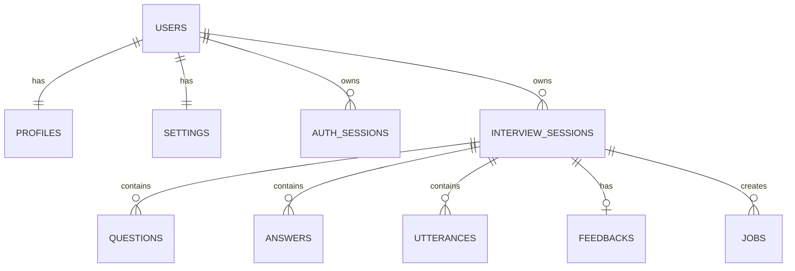

# AI面接練習支援システム DB設計書

## 1. 目的

本書は、AI面接練習支援システムのMVP実装に必要なデータベース設計を定義する。

対象は、ユーザ、プロフィール、設定、面接セッション、会話履歴、回答分析、フィードバック、ジョブ、Cookieセッションである。

## 2. DB選定

### 2.1 採用方針

MVPでは、Google Cloud Firestoreを採用する。

| 項目 | 方針 |
|---|---|
| DB | Firestore |
| 実行基盤 | Cloud Run Backend API |
| データ形式 | ドキュメント指向 |
| 音声データ | 保存しない |
| フィードバック | JSON構造で保存する |
| 将来候補 | Cloud SQL for PostgreSQL |

### 2.2 Firestoreを採用する理由

| 理由 | 内容 |
|---|---|
| Cloud Runと相性がよい | コネクションプール管理を避けやすい |
| 運用負荷が低い | サーバレスで開始しやすい |
| 会話履歴と相性がよい | 面接セッション配下に発話、質問、回答を持たせやすい |
| Gemini Structured Outputsと相性がよい | 分析結果やフィードバックをJSONに近い形で保存できる |
| MVPに向く | 個人利用、小規模利用では構成を軽くできる |

### 2.3 Cloud SQLを検討する条件

以下が必要になった場合は、Cloud SQL for PostgreSQLへの移行を検討する。

| 条件 | 理由 |
|---|---|
| 複雑な横断集計が増える | SQLの集計が有利 |
| 管理者画面で複数ユーザを分析する | リレーショナルな検索が増える |
| 厳密な外部キー制約が必要 | Firestoreではアプリ側制御が中心になる |
| BI連携が必要 | SQLベースの方が扱いやすい |

## 3. データ保存方針

| データ | 保存方針 |
|---|---|
| ユーザ基本情報 | 保存する |
| プロフィール | 保存する |
| 職歴 | プロフィール内に配列で保存する |
| 面接条件 | 保存する |
| AI質問文 | 保存する |
| ユーザ回答テキスト | 保存する |
| 音声認識結果 | テキストと信頼度のみ保存する |
| 回答音声ファイル | 保存しない |
| VOICEVOX生成音声 | 保存しない |
| 回答分析結果 | 保存する |
| フィードバック結果 | 保存する |
| Cookieセッション | 有効期限つきで保存する |
| APIキー | DBに保存しない。Secret ManagerまたはCloud Run環境変数で管理する |

## 4. コレクション一覧

| コレクション | 用途 |
|---|---|
| `users` | ユーザアカウント |
| `profiles` | 面接に利用するプロフィール |
| `settings` | 音声、モデル、保存方針の設定 |
| `authSessions` | Cookieセッション |
| `interviewSessions` | 面接セッション |
| `interviewSessions/{sessionId}/questions` | 面接中に生成された質問 |
| `interviewSessions/{sessionId}/answers` | ユーザ回答 |
| `interviewSessions/{sessionId}/utterances` | 会話履歴 |
| `feedbacks` | フィードバック結果 |
| `jobs` | 非同期ジョブ |

## 5. データ関連図



Firestoreでは外部キー制約は持たない。`userId`, `sessionId`, `questionId`, `answerId` などの参照整合性はアプリケーション側で保証する。

## 6. ドキュメント設計

### 6.1 users

Path:

```text
users/{userId}
```

| フィールド | 型 | 必須 | 内容 |
|---|---|---|---|
| `id` | string | yes | ユーザID |
| `googleSub` | string | yes | Googleアカウントの一意識別子 |
| `email` | string | yes | メールアドレス |
| `displayName` | string | yes | 表示名 |
| `profileCompleted` | boolean | yes | 初期プロフィール登録済みか |
| `createdAt` | timestamp | yes | 作成日時 |
| `updatedAt` | timestamp | yes | 更新日時 |
| `lastLoginAt` | timestamp | no | 最終ログイン日時 |
| `deletedAt` | timestamp | no | 論理削除日時 |

#### 例

```json
{
  "id": "usr_001",
  "googleSub": "google-oauth-sub",
  "email": "taro@example.com",
  "displayName": "田中 太郎",
  "profileCompleted": true,
  "createdAt": "2026-07-10T12:00:00+09:00",
  "updatedAt": "2026-07-10T12:00:00+09:00",
  "lastLoginAt": "2026-07-10T12:00:00+09:00"
}
```

### 6.2 profiles

Path:

```text
profiles/{userId}
```

| フィールド | 型 | 必須 | 内容 |
|---|---|---|---|
| `userId` | string | yes | ユーザID |
| `fullName` | string | yes | 氏名 |
| `educationType` | string | yes | 学歴区分 |
| `schoolName` | string | no | 学校名 |
| `department` | string | no | 学部・学科 |
| `graduationStatus` | string | no | 卒業状況 |
| `graduationYearMonth` | string | no | 卒業年月 |
| `hasWorkExperience` | boolean | yes | 職歴有無 |
| `workExperiences` | array | no | 職歴 |
| `desiredJobRole` | string | no | 希望職種 |
| `selfPrSeed` | string | no | 自己PR素材 |
| `createdAt` | timestamp | yes | 作成日時 |
| `updatedAt` | timestamp | yes | 更新日時 |

`workExperiences` の要素:

| フィールド | 型 | 内容 |
|---|---|---|
| `id` | string | 職歴ID |
| `companyName` | string | 会社名 |
| `jobTitle` | string | 職種・役割 |
| `startYearMonth` | string | 開始年月 |
| `endYearMonth` | string/null | 終了年月 |
| `responsibilities` | string | 職務内容 |

#### 例

```json
{
  "userId": "usr_001",
  "fullName": "田中 太郎",
  "educationType": "university",
  "schoolName": "東京サンプル大学",
  "department": "情報学部 情報工学科",
  "graduationStatus": "expected",
  "graduationYearMonth": "2027-03",
  "hasWorkExperience": true,
  "workExperiences": [
    {
      "id": "work_001",
      "companyName": "株式会社サンプル",
      "jobTitle": "開発職",
      "startYearMonth": "2024-04",
      "endYearMonth": null,
      "responsibilities": "社内ツール改善"
    }
  ],
  "desiredJobRole": "Webエンジニア",
  "selfPrSeed": "継続的に業務改善へ取り組んだ経験があります。",
  "createdAt": "2026-07-10T12:00:00+09:00",
  "updatedAt": "2026-07-10T12:00:00+09:00"
}
```

### 6.3 settings

Path:

```text
settings/{userId}
```

| フィールド | 型 | 必須 | 内容 |
|---|---|---|---|
| `userId` | string | yes | ユーザID |
| `voicevoxSpeaker` | string | yes | VOICEVOX話者 |
| `speechRecognitionModel` | string | yes | 音声認識モデル |
| `questionGenerationModel` | string | yes | 質問生成モデル |
| `answerAnalysisModel` | string | yes | 回答分析モデル |
| `feedbackGenerationModel` | string | yes | フィードバック生成モデル |
| `speedScale` | number | yes | 話速 |
| `volumeScale` | number | yes | 音量 |
| `saveAudio` | boolean | yes | 音声保存設定。MVPではfalse固定 |
| `updatedAt` | timestamp | yes | 更新日時 |

#### 例

```json
{
  "userId": "usr_001",
  "voicevoxSpeaker": "四国めたん",
  "speechRecognitionModel": "chirp_3",
  "questionGenerationModel": "gemini-2.5-flash",
  "answerAnalysisModel": "gemini-2.5-flash",
  "feedbackGenerationModel": "gemini-2.5-pro",
  "speedScale": 1.0,
  "volumeScale": 1.0,
  "saveAudio": false,
  "updatedAt": "2026-07-10T12:00:00+09:00"
}
```

### 6.4 authSessions

Path:

```text
authSessions/{sessionId}
```

| フィールド | 型 | 必須 | 内容 |
|---|---|---|---|
| `sessionIdHash` | string | yes | CookieセッションIDのハッシュ |
| `userId` | string | yes | ユーザID |
| `csrfTokenHash` | string | no | CSRFトークンのハッシュ |
| `createdAt` | timestamp | yes | 作成日時 |
| `expiresAt` | timestamp | yes | 有効期限 |
| `revokedAt` | timestamp | no | 失効日時 |
| `userAgentHash` | string | no | User-Agentのハッシュ |

Cookieに格納するセッションIDの平文はDBに保存しない。

### 6.5 interviewSessions

Path:

```text
interviewSessions/{sessionId}
```

| フィールド | 型 | 必須 | 内容 |
|---|---|---|---|
| `id` | string | yes | 面接セッションID |
| `userId` | string | yes | ユーザID |
| `status` | string | yes | 面接セッション状態 |
| `interviewType` | string | yes | 面接種別 |
| `jobRole` | string | yes | 職種 |
| `industry` | string | no | 業界 |
| `companyName` | string/null | no | 企業名 |
| `practiceTheme` | string | yes | 練習テーマ |
| `questionCount` | number | yes | 予定質問数 |
| `answeredCount` | number | yes | 回答済み数 |
| `currentQuestionId` | string/null | no | 現在の質問ID |
| `feedbackStatus` | string | yes | フィードバック状態 |
| `summary` | string | no | 履歴一覧用要約 |
| `createdAt` | timestamp | yes | 作成日時 |
| `startedAt` | timestamp | no | 開始日時 |
| `finishedAt` | timestamp | no | 終了日時 |
| `updatedAt` | timestamp | yes | 更新日時 |
| `deletedAt` | timestamp | no | 論理削除日時 |

### 6.6 interviewSessions/{sessionId}/questions

Path:

```text
interviewSessions/{sessionId}/questions/{questionId}
```

| フィールド | 型 | 必須 | 内容 |
|---|---|---|---|
| `id` | string | yes | 質問ID |
| `sessionId` | string | yes | 面接セッションID |
| `userId` | string | yes | ユーザID |
| `type` | string | yes | 質問種別 |
| `text` | string | yes | 質問文 |
| `reason` | string | no | 質問生成理由 |
| `baseAnswerId` | string/null | no | 元になった回答ID |
| `aiResponseStatus` | string | yes | AI応答状態 |
| `voiceStatus` | string | no | 音声生成状態 |
| `voiceId` | string/null | no | 音声ID。音声自体は保存しない |
| `createdAt` | timestamp | yes | 作成日時 |

`type` は `fixed_confirmation`, `normal`, `deep_dive`, `confirmation` を想定する。

### 6.7 interviewSessions/{sessionId}/answers

Path:

```text
interviewSessions/{sessionId}/answers/{answerId}
```

| フィールド | 型 | 必須 | 内容 |
|---|---|---|---|
| `id` | string | yes | 回答ID |
| `sessionId` | string | yes | 面接セッションID |
| `userId` | string | yes | ユーザID |
| `questionId` | string | yes | 対象質問ID |
| `text` | string | yes | 回答テキスト |
| `inputType` | string | yes | `speech` または `text` |
| `speechTranscriptConfidence` | number/null | no | 音声認識信頼度 |
| `analysis` | map | no | Geminiによる回答分析結果 |
| `nextAction` | string | no | 次アクション |
| `createdAt` | timestamp | yes | 作成日時 |

`analysis` の例:

```json
{
  "status": "completed",
  "abstractness": "medium",
  "specificity": "low",
  "consistency": "needs_confirmation",
  "contradictionCandidates": [
    {
      "description": "登録職歴の期間と回答内の時期に差異の可能性があります。",
      "severity": "medium",
      "evidence": ["profile.workExperiences[0].startYearMonth", "utt_008"]
    }
  ],
  "deepDiveNeeded": true
}
```

### 6.8 interviewSessions/{sessionId}/utterances

Path:

```text
interviewSessions/{sessionId}/utterances/{utteranceId}
```

| フィールド | 型 | 必須 | 内容 |
|---|---|---|---|
| `id` | string | yes | 発話ID |
| `sessionId` | string | yes | 面接セッションID |
| `userId` | string | yes | ユーザID |
| `speaker` | string | yes | `ai` または `user` |
| `text` | string | yes | 発話テキスト |
| `questionId` | string/null | no | 関連質問ID |
| `answerId` | string/null | no | 関連回答ID |
| `questionType` | string/null | no | 質問種別 |
| `sequenceNo` | number | yes | 会話順 |
| `createdAt` | timestamp | yes | 作成日時 |

会話履歴表示では `sequenceNo` 昇順で取得する。

### 6.9 feedbacks

Path:

```text
feedbacks/{feedbackId}
```

| フィールド | 型 | 必須 | 内容 |
|---|---|---|---|
| `id` | string | yes | フィードバックID |
| `sessionId` | string | yes | 面接セッションID |
| `userId` | string | yes | ユーザID |
| `status` | string | yes | フィードバック状態 |
| `overallSummary` | string | yes | 総評 |
| `goodPoints` | array | no | 良かった点 |
| `abstractPoints` | array | no | 抽象的だった箇所 |
| `consistencyCandidates` | array | no | 矛盾候補 |
| `deepDiveShortage` | array | no | 深掘り不足 |
| `improvedAnswerExample` | string | no | 改善回答例 |
| `nextPracticeThemes` | array | no | 次回練習テーマ |
| `createdAt` | timestamp | yes | 作成日時 |
| `updatedAt` | timestamp | yes | 更新日時 |

### 6.10 jobs

Path:

```text
jobs/{jobId}
```

| フィールド | 型 | 必須 | 内容 |
|---|---|---|---|
| `id` | string | yes | ジョブID |
| `type` | string | yes | `feedback_generation` |
| `status` | string | yes | ジョブ状態 |
| `sessionId` | string | yes | 面接セッションID |
| `userId` | string | yes | ユーザID |
| `progress` | number | yes | 進捗率 |
| `resultRef` | map/null | no | 結果参照 |
| `error` | map/null | no | エラー情報 |
| `createdAt` | timestamp | yes | 作成日時 |
| `updatedAt` | timestamp | yes | 更新日時 |
| `startedAt` | timestamp | no | 実行開始日時 |
| `completedAt` | timestamp | no | 完了日時 |

`resultRef` の例:

```json
{
  "type": "feedback",
  "feedbackId": "fb_001",
  "sessionId": "ses_001"
}
```

## 7. インデックス設計

Firestoreでは、以下の検索に必要なインデックスを作成する。

| 用途 | コレクション | 条件 | 並び順 |
|---|---|---|---|
| 面接履歴一覧 | `interviewSessions` | `userId == ?`, `deletedAt == null` | `createdAt desc` |
| 面接状態別検索 | `interviewSessions` | `userId == ?`, `status == ?` | `updatedAt desc` |
| ジョブ状態取得 | `jobs` | `userId == ?`, `status == ?` | `createdAt desc` |
| セッション別フィードバック取得 | `feedbacks` | `sessionId == ?`, `userId == ?` | `createdAt desc` |
| Cookieセッション期限管理 | `authSessions` | `expiresAt < now` | `expiresAt asc` |

サブコレクションでは以下の順序を使う。

| 用途 | Path | 並び順 |
|---|---|---|
| 会話履歴表示 | `interviewSessions/{sessionId}/utterances` | `sequenceNo asc` |
| 質問履歴 | `interviewSessions/{sessionId}/questions` | `createdAt asc` |
| 回答履歴 | `interviewSessions/{sessionId}/answers` | `createdAt asc` |

## 8. 更新トランザクション

### 8.1 回答送信時

回答送信時は、以下を一貫して更新する。

| 対象 | 更新内容 |
|---|---|
| `answers` | 回答テキスト、入力種別、音声認識信頼度、分析結果を保存 |
| `utterances` | ユーザ発話を追加 |
| `interviewSessions` | `answeredCount`, `status`, `updatedAt` を更新 |

必要に応じてFirestoreトランザクションまたはバッチ書き込みを使う。

### 8.2 質問生成時

| 対象 | 更新内容 |
|---|---|
| `questions` | 質問文、種別、生成理由を保存 |
| `utterances` | AI発話を追加 |
| `interviewSessions` | `currentQuestionId`, `status`, `updatedAt` を更新 |

### 8.3 フィードバック生成完了時

| 対象 | 更新内容 |
|---|---|
| `feedbacks` | フィードバック結果を保存 |
| `jobs` | `status`, `progress`, `resultRef`, `completedAt` を更新 |
| `interviewSessions` | `feedbackStatus`, `summary`, `updatedAt` を更新 |

## 9. セキュリティ設計

| 項目 | 方針 |
|---|---|
| 認可 | すべてのドキュメントで `userId` を確認する |
| Cookieセッション | セッションIDの平文は保存しない |
| 音声データ | DBに保存しない |
| APIキー | DBに保存しない |
| 論理削除 | 履歴削除は `deletedAt` を設定する |
| 監査 | 必要に応じて作成日時、更新日時、実行ユーザを保存する |

Firestore Security Rulesを使う場合でも、MVPではブラウザからFirestoreを直接呼ばず、Cloud Run Backend API経由でアクセスする。

## 10. 削除方針

| 操作 | 方針 |
|---|---|
| 面接履歴削除 | `interviewSessions.deletedAt` を設定する |
| 会話履歴 | 面接履歴削除時も物理削除せず、履歴詳細では非表示にする |
| フィードバック | 面接履歴削除時は非表示にする |
| Cookieセッション | ログアウト時に `revokedAt` を設定する |
| 期限切れセッション | 定期処理で削除または無効化する |

MVPでは復旧性を優先し、面接データの物理削除は後続課題とする。

## 11. APIとの対応

| API | 主な参照・更新コレクション |
|---|---|
| `GET /auth/me` | `authSessions`, `users` |
| `POST /auth/logout` | `authSessions` |
| `GET /profile` | `profiles` |
| `PUT /profile` | `profiles`, `users` |
| `GET /settings` | `settings` |
| `PUT /settings` | `settings` |
| `POST /interview-sessions` | `interviewSessions` |
| `GET /interview-sessions` | `interviewSessions` |
| `GET /interview-sessions/{id}` | `interviewSessions`, `questions`, `answers`, `utterances` |
| `POST /initial-question` | `questions`, `utterances`, `interviewSessions` |
| `POST /speech/recognize` | DB保存なし。認識結果のみレスポンス |
| `POST /answers` | `answers`, `utterances`, `interviewSessions` |
| `POST /next-question` | `questions`, `utterances`, `interviewSessions` |
| `POST /voice/synthesize` | DB保存なし。必要に応じて `questions.voiceStatus` 更新 |
| `POST /finish` | `interviewSessions` |
| `POST /feedback` | `jobs`, `interviewSessions` |
| `GET /jobs/{jobId}` | `jobs` |
| `GET /feedback` | `feedbacks` |

## 12. MVPで保持しないデータ

| データ | 理由 |
|---|---|
| ユーザ回答音声ファイル | プライバシーと保存コストを抑えるため |
| VOICEVOX生成音声ファイル | 再生成可能であり保存不要のため |
| Geminiへの全文プロンプトログ | 個人情報を含む可能性があるため |
| Google Cloud Speech-to-Textへ送信した音声 | 音声非保存方針のため |

## 13. 参考情報

- Firestore: https://cloud.google.com/firestore/docs/overview
- Cloud SQL for PostgreSQL: https://docs.cloud.google.com/sql/docs/postgres
