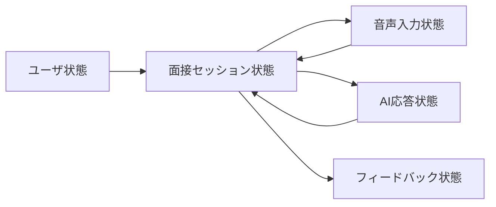
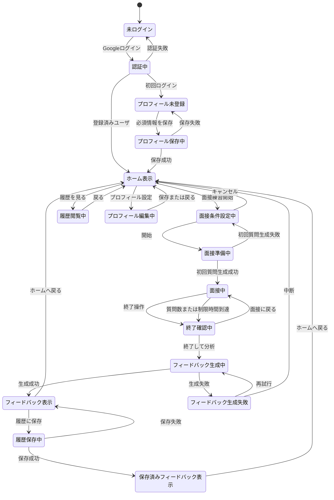
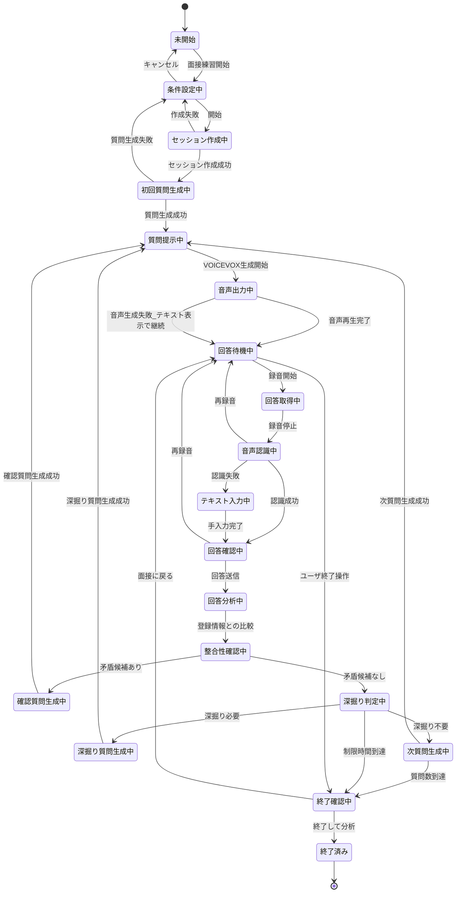
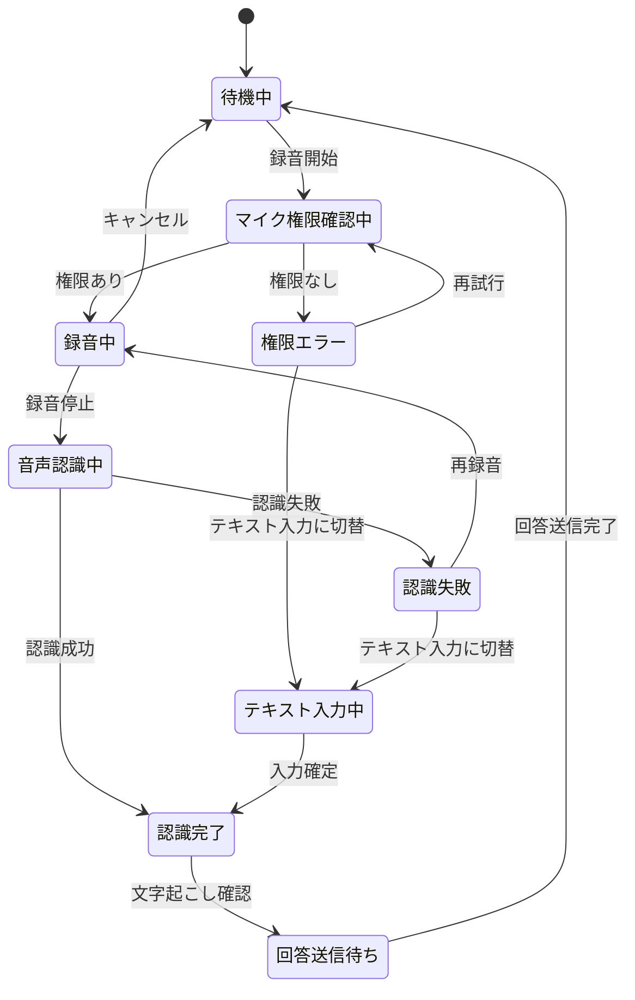
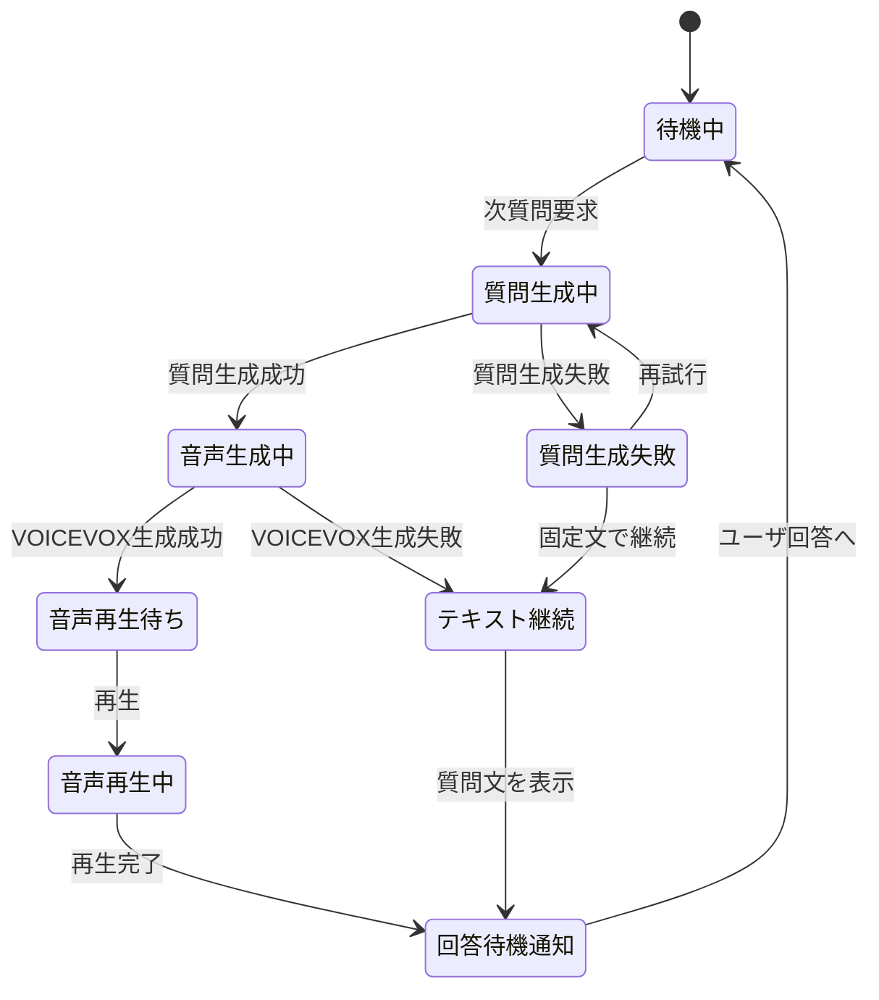
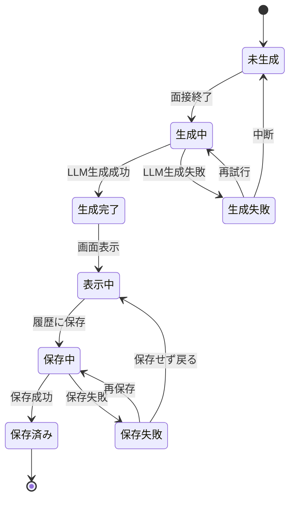

# AI面接練習支援システム 状態遷移設計書

## 1. 目的

本書は、AI面接練習支援システムにおける主要な状態遷移を定義する。

本システムでは、ログイン、プロフィール登録、面接条件設定、音声入力、音声認識、LLM分析、VOICEVOX音声出力、フィードバック生成など、複数の非同期処理が連続して発生する。そのため、画面設計・API設計・実装に先立ち、ユーザ状態、面接セッション状態、音声入力状態、AI応答状態、フィードバック生成状態を整理する。

## 2. 状態遷移の対象

本書では、画面単位ではなく、システム内部で管理すべき状態単位ごとに状態遷移を定義する。

| 対象 | 管理対象 | 主な責務 | 関連画面 |
|---|---|---|---|
| ユーザ状態 | ログイン状態、初期プロフィール登録状態 | ユーザがシステムを利用可能か判定する | SCR-001, SCR-002, SCR-003 |
| 面接セッション状態 | 1回の面接練習の進行状態 | 面接開始から終了までの流れを管理する | SCR-004, SCR-005, SCR-006 |
| 音声入力状態 | ユーザ回答の録音、音声認識、文字起こし結果 | ユーザの回答を取得し、送信可能なテキストにする | SCR-005 |
| AI応答状態 | LLM質問生成、VOICEVOX音声生成、音声再生 | AI面接官の質問・応答を生成して提示する | SCR-005 |
| フィードバック状態 | 面接終了後の分析、フィードバック生成、保存 | 面接結果を分析し、結果を表示・保存する | SCR-006, SCR-007, SCR-009 |

### 2.1 状態管理単位の関係

各状態管理単位は独立して存在するが、面接中は相互に連動する。たとえば、面接セッション状態が「回答待機中」のときだけ、音声入力状態は「録音中」へ遷移できる。音声入力状態が「回答送信待ち」になった後、面接セッション状態は「回答分析中」へ進む。

### 2.2 各状態管理単位の状態定義

#### ユーザ状態

| 状態 | 意味 | 次に可能な主な操作 |
|---|---|---|
| 未ログイン | 認証が完了していない | Googleログイン |
| 認証中 | 外部認証処理中 | 認証完了待ち |
| プロフィール未登録 | ログイン済みだが必須プロフィールが未登録 | 初期プロフィール保存 |
| ホーム表示 | 面接練習を開始可能 | 面接開始、履歴確認、設定変更 |
| プロフィール編集中 | 登録済みプロフィールを変更中 | 保存、破棄、戻る |
| 履歴閲覧中 | 過去の面接履歴を閲覧中 | 詳細確認、削除、戻る |

#### 面接セッション状態

| 状態 | 意味 | 次に可能な主な操作・処理 |
|---|---|---|
| 未開始 | 面接セッションが存在しない | 面接条件設定へ進む |
| 条件設定中 | 面接種別、職種、テーマ、質問数を入力中 | セッション作成、キャンセル |
| セッション作成中 | 面接セッションの保存・初期化中 | 初回質問生成へ進む |
| 初回質問生成中 | LLMが最初の質問を生成中 | 質問提示、再試行 |
| 質問提示中 | AI面接官の質問文を画面に表示中 | 音声出力、回答待機 |
| 音声出力中 | VOICEVOXで質問音声を生成・再生中 | 回答待機へ進む |
| 回答待機中 | ユーザの回答入力を待っている | 録音開始、テキスト入力、終了 |
| 回答取得中 | ユーザが録音している | 録音停止、キャンセル |
| 音声認識中 | 録音音声をテキスト化している | 認識完了、再録音、テキスト入力 |
| 回答確認中 | 文字起こし結果をユーザが確認している | 回答送信、再録音 |
| 回答分析中 | LLMが回答内容を分析している | 整合性確認へ進む |
| 整合性確認中 | 登録済みプロフィールや過去回答との差異を確認している | 確認質問生成、深掘り判定 |
| 確認質問生成中 | 矛盾候補や不明点に対する確認質問を生成している | 質問提示 |
| 深掘り判定中 | 回答に深掘りが必要か判定している | 深掘り質問生成、次質問生成、終了確認 |
| 深掘り質問生成中 | 回答内容に応じた追加質問を生成している | 質問提示 |
| 次質問生成中 | 面接条件に沿った次の通常質問を生成している | 質問提示、終了確認 |
| 終了確認中 | 面接を終了するか確認している | 面接に戻る、終了して分析 |
| 終了済み | 面接セッションが完了している | フィードバック生成 |

#### 音声入力状態

| 状態 | 意味 | 次に可能な主な操作・処理 |
|---|---|---|
| 待機中 | 録音開始前 | 録音開始 |
| マイク権限確認中 | ブラウザまたはOSのマイク権限を確認中 | 録音開始、権限エラー |
| 録音中 | ユーザの回答音声を取得中 | 録音停止、キャンセル |
| 音声認識中 | 録音音声をテキスト化中 | 認識完了、認識失敗 |
| 認識完了 | 文字起こし結果が作成された | 文字起こし確認 |
| 認識失敗 | 音声認識に失敗した | 再録音、テキスト入力 |
| テキスト入力中 | 音声入力の代替として手入力中 | 入力確定 |
| 回答送信待ち | 回答テキストが確定し、LLM分析へ送信可能 | 回答送信 |

#### AI応答状態

| 状態 | 意味 | 次に可能な主な操作・処理 |
|---|---|---|
| 待機中 | AI応答生成を行っていない | 次質問要求 |
| 質問生成中 | LLMが質問文を生成中 | 音声生成、再試行 |
| 質問生成失敗 | LLM質問生成に失敗した | 再試行、固定質問で継続 |
| 音声生成中 | VOICEVOXが質問音声を生成中 | 音声再生待ち、テキスト継続 |
| 音声再生待ち | 音声生成が完了し、再生可能 | 再生 |
| 音声再生中 | 質問音声を再生中 | 回答待機通知 |
| テキスト継続 | 音声出力なしで質問文のみ表示して継続する | 回答待機通知 |
| 回答待機通知 | ユーザ回答へ移ることを面接セッションへ通知する | 待機中 |

#### フィードバック状態

| 状態 | 意味 | 次に可能な主な操作・処理 |
|---|---|---|
| 未生成 | フィードバックがまだ生成されていない | 生成開始 |
| 生成中 | LLMが面接全体を分析している | 生成完了、生成失敗 |
| 生成失敗 | フィードバック生成に失敗した | 再試行、中断 |
| 生成完了 | フィードバックデータが作成された | 表示 |
| 表示中 | フィードバックを画面に表示中 | 保存、ホームへ戻る |
| 保存中 | 面接履歴とフィードバックを保存中 | 保存済み、保存失敗 |
| 保存失敗 | 保存に失敗した | 再保存、保存せず戻る |
| 保存済み | 保存が完了した | ホームへ戻る |

### 2.3 状態名の扱い

状態名は、実装時にそのまま内部ステータス名として利用できる粒度を目安とする。ただし、画面表示文言としてそのまま出す必要はない。たとえば内部状態が「整合性確認中」の場合、画面上は「回答を確認しています」と表示してよい。

### 2.4 状態遷移の前提

| 前提 | 内容 |
|---|---|
| 面接セッション状態を主軸とする | 面接中の進行可否は面接セッション状態で判断する |
| 音声入力状態は回答取得の局所状態とする | 録音から回答送信待ちまでを管理し、回答送信後は面接セッション状態へ戻す |
| AI応答状態は質問提示の局所状態とする | LLM質問生成からVOICEVOX再生完了までを管理する |
| フィードバック状態は面接終了後のみ有効とする | 面接中にはフィードバック状態へ遷移しない |
| エラー状態は復旧可能にする | 音声・LLM・保存失敗時も、再試行または代替手段を提示する |

## 3. 全体状態遷移

## 4. 面接セッション状態遷移

## 5. 音声入力状態遷移

## 6. AI応答状態遷移

## 7. フィードバック生成状態遷移

## 8. 状態別エラー復旧方針

| 発生状態 | エラー | 復旧方針 |
|---|---|---|
| 認証中 | Google OAuth失敗 | 再ログインを提示する |
| プロフィール保存中 | 保存失敗 | 入力内容を保持したまま再保存を提示する |
| 初回質問生成中 | LLM失敗 | 再試行、または定型質問で開始する |
| 音声出力中 | VOICEVOX失敗 | 質問文をテキスト表示し、音声なしで継続可能にする |
| 音声認識中 | 認識失敗 | 再録音またはテキスト入力へ切替可能にする |
| 回答分析中 | LLM失敗 | 再試行、または回答を保存して一時停止する |
| フィードバック生成中 | LLM失敗 | 再試行、または会話履歴のみ保存する |
| 履歴保存中 | DB保存失敗 | フィードバック表示を維持し、再保存を提示する |

## 9. 画面設計への反映

| 状態管理単位 | 状態 | 関連画面 | 画面側で必要な制御 |
|---|---|---|---|
| ユーザ状態 | プロフィール未登録 | SCR-002 | 必須項目入力完了までホーム・面接開始へ進めない |
| ユーザ状態 | プロフィール編集中 | SCR-010 | 未保存変更がある場合、画面離脱時に確認する |
| 面接セッション状態 | 条件設定中 | SCR-004 | 必須項目が揃うまで開始ボタンを無効化する |
| 面接セッション状態 | セッション作成中 | SCR-004 | 開始ボタンをローディング表示にし、二重送信を防ぐ |
| 面接セッション状態 | 初回質問生成中 | SCR-005 | 面接開始直後の生成中表示を行い、録音操作を無効化する |
| 面接セッション状態 | 質問提示中 | SCR-005 | 質問文を表示し、音声生成または再生状態を表示する |
| 面接セッション状態 | 回答待機中 | SCR-005 | 録音開始、テキスト入力、面接終了を操作可能にする |
| 音声入力状態 | 録音中 | SCR-005 | 録音中表示、録音停止ボタン表示、回答送信ボタン無効化 |
| 音声入力状態 | 音声認識中 | SCR-005 | 認識中表示、録音操作を無効化する |
| 音声入力状態 | 認識失敗 | SCR-005 | 再録音、テキスト入力切替を提示する |
| 音声入力状態 | 回答送信待ち | SCR-005 | 回答送信ボタンを有効化し、文字起こし編集を可能にする |
| 面接セッション状態 | 回答分析中 | SCR-005 | 分析中表示、録音・回答送信を無効化する |
| 面接セッション状態 | 確認質問生成中 | SCR-005 | 登録情報との差異確認中であることを表示する |
| 面接セッション状態 | 深掘り質問生成中 | SCR-005 | 深掘り質問生成中であることを表示する |
| 面接セッション状態 | 終了確認中 | SCR-006 | 終了して分析、面接に戻るを選択可能にする |
| フィードバック状態 | 生成中 | SCR-007 | フィードバック生成中表示を行い、離脱時の扱いを制御する |
| フィードバック状態 | 生成失敗 | SCR-007 | 再試行、会話履歴のみ保存、中断を提示する |
| フィードバック状態 | 表示中 | SCR-007 | フィードバック、根拠発話、改善例を表示する |
| フィードバック状態 | 保存失敗 | SCR-007 | フィードバックを保持し、再保存可能にする |

## 10. 未確定事項

| 項目 | 確認内容 |
|---|---|
| 定型質問での継続 | LLM失敗時に、固定質問で面接を継続するか |
| 面接一時停止 | LLMや通信障害時に、セッションを一時停止して再開可能にするか |
| 自動保存 | 面接中の会話履歴を逐次保存するか、終了時にまとめて保存するか |
| 音声認識結果の編集 | ユーザが文字起こし結果をどの範囲まで編集できるか |
| フィードバック生成中の離脱 | 生成中にユーザが画面を閉じた場合、バックグラウンド生成を継続するか |
