# AI面接練習支援システム API処理シーケンス詳細設計書

## 1. 目的

本書は、APIごとの処理シーケンスを詳細化し、Controller、Service、Repository、外部APIの呼び出し順、状態更新、失敗時分岐を定義する。

## 2. 共通処理

### 2.1 認証つきAPI共通シーケンス

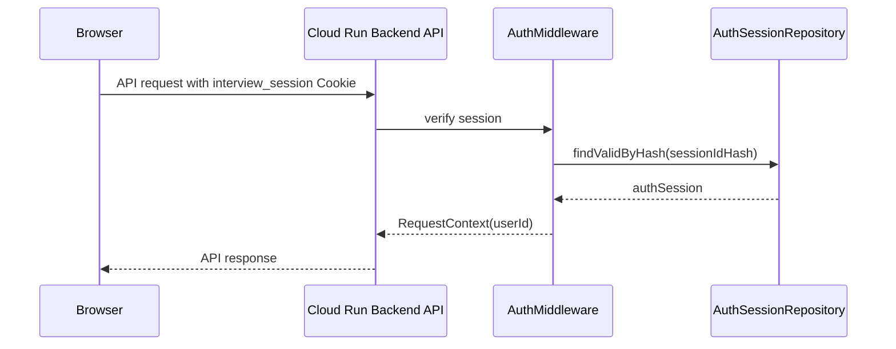

認証失敗時は `401 UNAUTHORIZED` を返す。

### 2.2 状態チェック共通シーケンス

```text
1. sessionIdを受け取る
2. InterviewSessionRepository.findByIdForUser(ctx, sessionId)
3. sessionが存在しなければ404
4. session.userIdがctx.userIdと異なれば403
5. 許可状態でなければ409 INVALID_STATE
6. 業務処理を続行
```

## 3. プロフィール保存

対象API:

```http
PUT /api/v1/profile
```

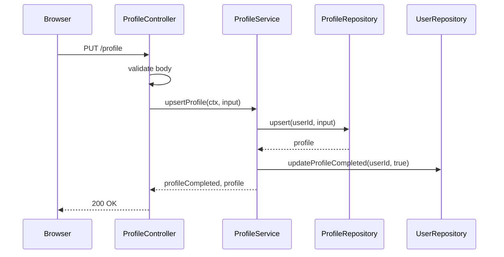

失敗時:

| 条件 | 応答 |
|---|---|
| 必須項目不足 | `400 VALIDATION_ERROR` |
| 未ログイン | `401 UNAUTHORIZED` |
| Firestore更新失敗 | `500 INTERNAL_ERROR` |

## 4. 面接セッション作成

対象API:

```http
POST /api/v1/interview-sessions
```

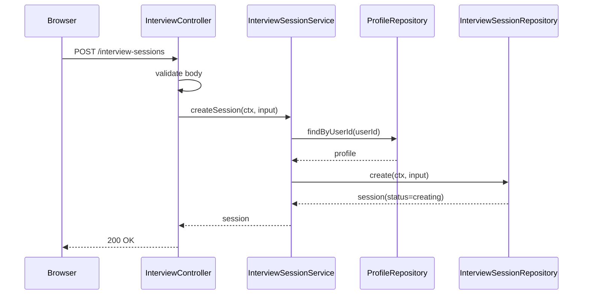

処理ルール:

| 項目 | 内容 |
|---|---|
| プロフィール未登録 | 面接開始不可 |
| 初期状態 | `creating` |
| `answeredCount` | 0 |
| `feedbackStatus` | `not_generated` |

## 5. 初回質問生成

対象API:

```http
POST /api/v1/interview-sessions/{sessionId}/initial-question
```

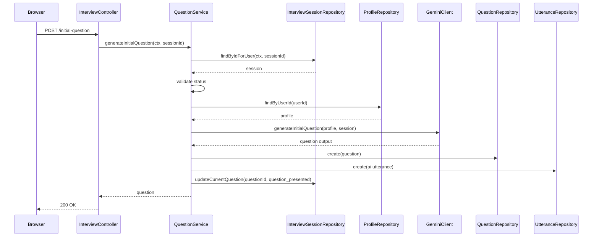

状態更新:

| 更新対象 | 更新内容 |
|---|---|
| `interviewSessions.status` | `question_presented` |
| `interviewSessions.currentQuestionId` | 作成した質問ID |
| `questions.aiResponseStatus` | `question_generating` から `voice_generating` |
| `utterances` | AI発話を追加 |

Gemini失敗時:

| 条件 | 応答 |
|---|---|
| Gemini API失敗 | `502 EXTERNAL_SERVICE_ERROR` |
| 代替案 | 固定質問で継続可能にする |

## 6. VOICEVOX音声生成

対象API:

```http
POST /api/v1/voice/synthesize
```

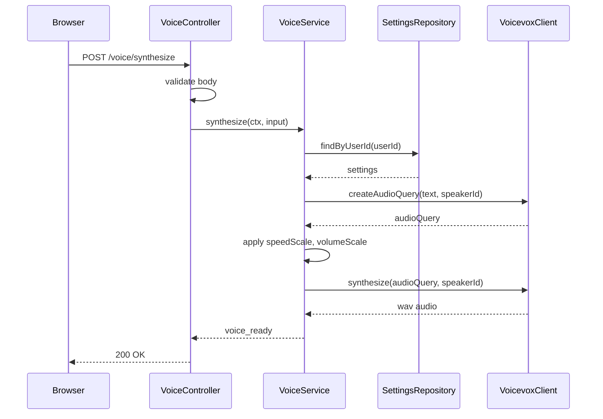

VOICEVOX失敗時:

```json
{
  "aiResponseStatus": "text_only",
  "voice": null
}
```

失敗しても面接は継続する。

## 7. 音声認識

対象API:

```http
POST /api/v1/speech/recognize
```

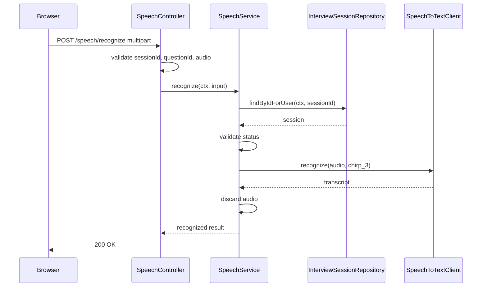

DB保存:

| データ | 保存 |
|---|---|
| 音声バイナリ | しない |
| 文字起こしテキスト | このAPIでは保存しない |
| 信頼度 | このAPIでは保存しない |

文字起こし結果は、ユーザ確認後 `POST /answers` で保存する。

認識失敗時:

```json
{
  "speechInputStatus": "recognition_failed",
  "recoveries": ["retry_recording", "text_input"]
}
```

## 8. 回答送信・回答分析

対象API:

```http
POST /api/v1/interview-sessions/{sessionId}/answers
```

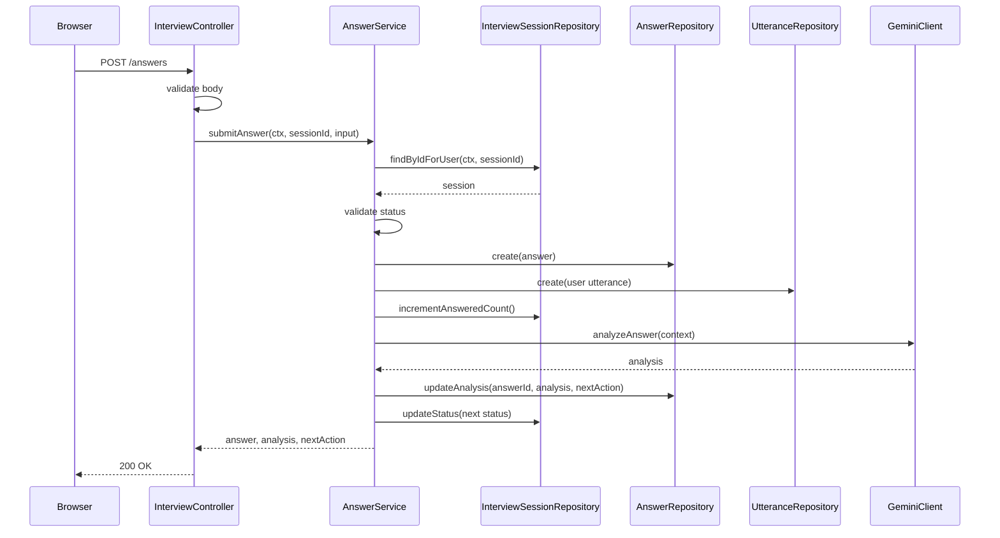

状態更新:

| `nextAction` | 次状態 |
|---|---|
| `generate_confirmation_question` | `confirmation_question_generating` |
| `generate_deep_dive_question` | `deep_dive_question_generating` |
| `generate_normal_question` | `next_question_generating` |
| `finish_interview` | `finish_confirming` |

Gemini分析失敗時:

| 方針 | 内容 |
|---|---|
| 回答保存 | 維持する |
| 分析結果 | `analysis.status=failed` として保存可能 |
| 画面 | 再分析または固定質問で継続 |

## 9. 次質問生成

対象API:

```http
POST /api/v1/interview-sessions/{sessionId}/next-question
```

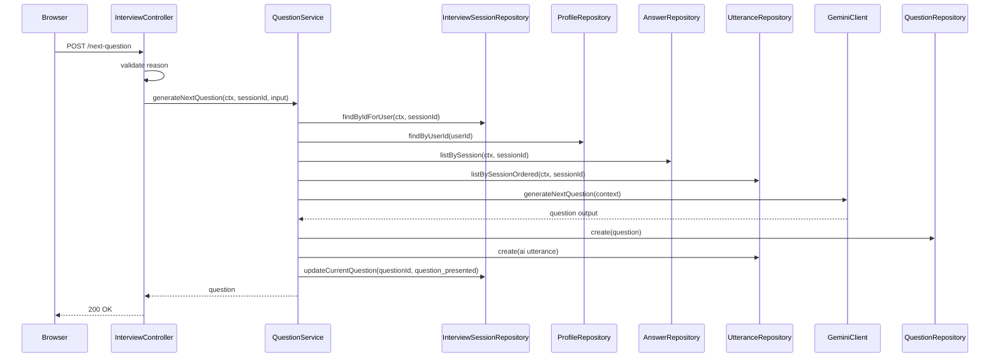

`reason` ごとのGemini入力:

| reason | 追加コンテキスト |
|---|---|
| `normal` | 面接条件、既出質問、回答履歴 |
| `deep_dive` | 対象回答、抽象度、具体性不足 |
| `confirmation` | 矛盾候補、プロフィール該当箇所、対象回答 |

## 10. 面接終了

対象API:

```http
POST /api/v1/interview-sessions/{sessionId}/finish
```

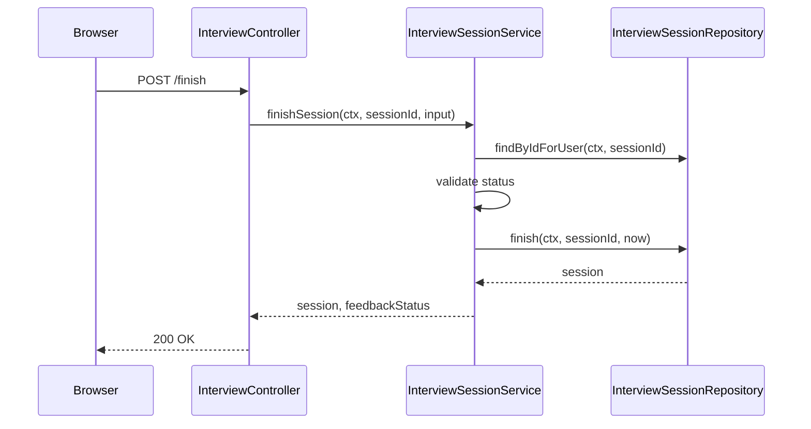

終了後の状態:

| 項目 | 値 |
|---|---|
| `interviewSessions.status` | `finished` |
| `feedbackStatus` | `not_generated` |
| `finishedAt` | 現在日時 |

## 11. フィードバック生成ジョブ開始

対象API:

```http
POST /api/v1/interview-sessions/{sessionId}/feedback
```

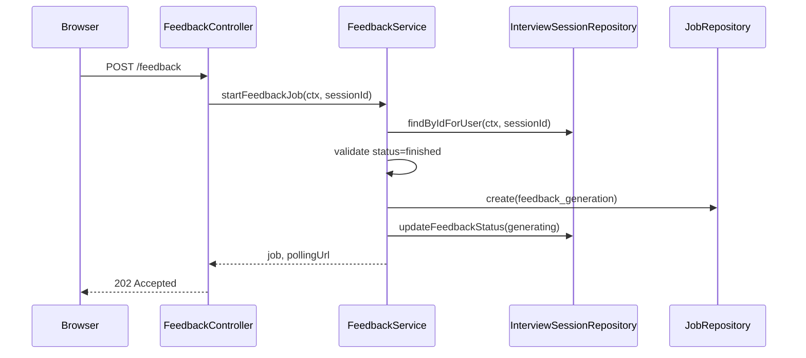

作成時のジョブ:

| 項目 | 値 |
|---|---|
| `type` | `feedback_generation` |
| `status` | `queued` |
| `progress` | 0 |

## 12. フィードバック生成ジョブ実行

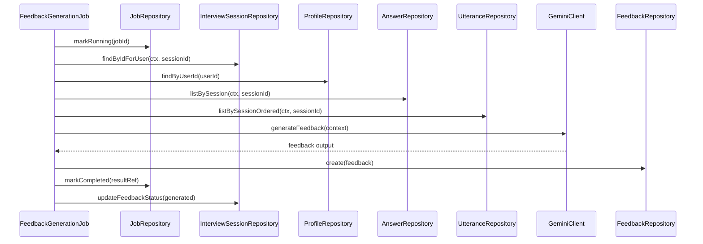

失敗時:

| 処理 | 内容 |
|---|---|
| `jobs.status` | `failed` |
| `jobs.error` | エラーコードとメッセージ |
| `interviewSessions.feedbackStatus` | `generation_failed` |
| 復旧 | ユーザが再生成可能 |

## 13. ジョブ状態取得

対象API:

```http
GET /api/v1/jobs/{jobId}
```

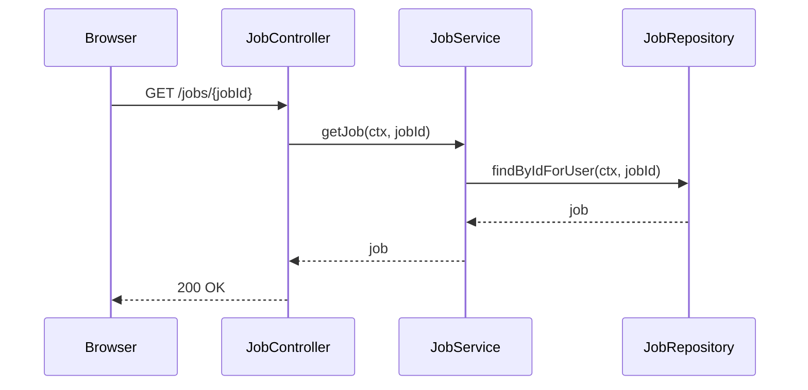

認可:

| 条件 | 応答 |
|---|---|
| jobが存在しない | `404 NOT_FOUND` |
| job.userIdが異なる | `403 FORBIDDEN` |

## 14. フィードバック取得

対象API:

```http
GET /api/v1/interview-sessions/{sessionId}/feedback
```

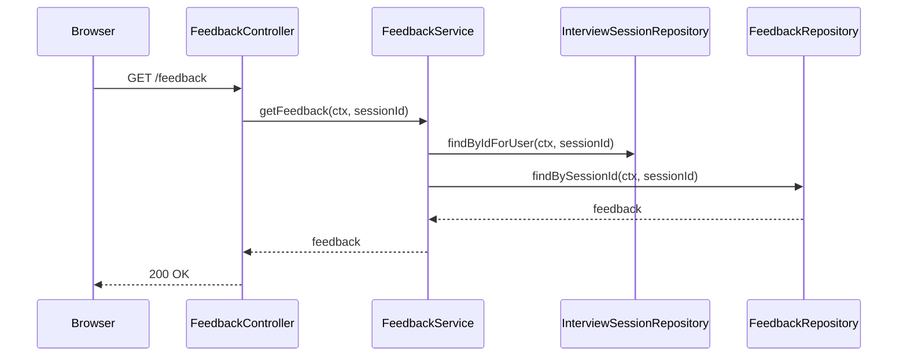

未生成時:

```json
{
  "feedbackStatus": "not_generated",
  "feedback": null
}
```

## 15. 設定更新

対象API:

```http
PUT /api/v1/settings
```

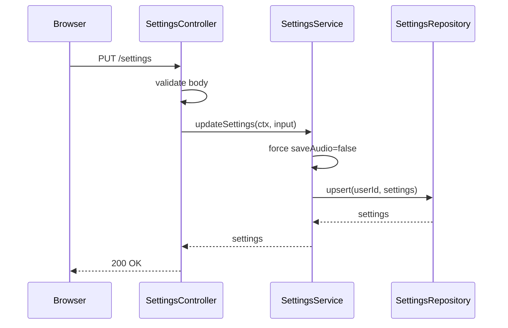

バリデーション:

| 項目 | 条件 |
|---|---|
| `speedScale` | 0.5以上2.0以下、0.1刻み |
| `volumeScale` | 0.5以上2.0以下、0.1刻み |
| `saveAudio` | `false` 固定 |

## 16. 失敗時の共通復旧方針

| 失敗箇所 | 復旧 |
|---|---|
| Speech-to-Text | 再録音、テキスト入力 |
| Gemini質問生成 | 再試行、固定質問で継続 |
| Gemini回答分析 | 回答保存済みとして再分析、または次質問へ進む |
| VOICEVOX | 質問文のみ表示して継続 |
| Feedback job | 再生成 |
| Firestore | リトライせずエラー表示。二重登録に注意 |

## 17. 実装優先度

| 優先度 | API |
|---|---|
| 1 | `GET /auth/me`, `PUT /profile`, `GET /settings`, `PUT /settings` |
| 2 | `POST /interview-sessions`, `GET /interview-sessions/{id}` |
| 3 | `POST /initial-question`, `POST /next-question` |
| 4 | `POST /speech/recognize`, `POST /answers` |
| 5 | `POST /voice/synthesize` |
| 6 | `POST /finish`, `POST /feedback`, `GET /jobs/{jobId}`, `GET /feedback` |
