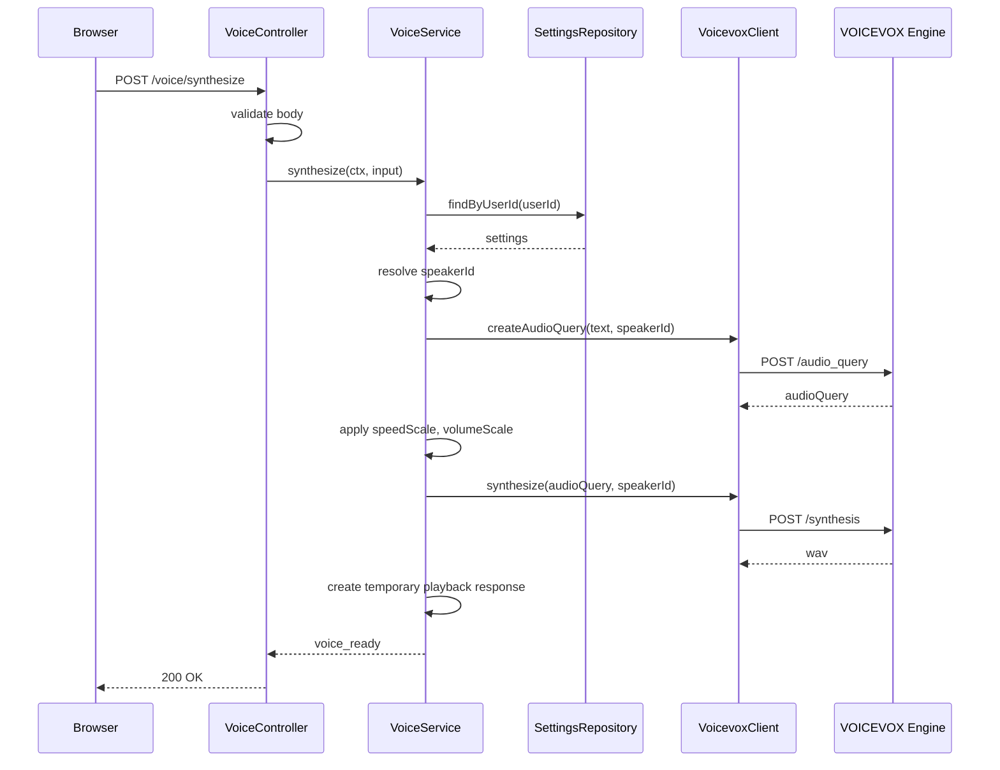

# AI面接練習支援システム VOICEVOX連携詳細設計書

## 1. 目的

本書は、AI面接官の音声出力に利用するVOICEVOX Engine API連携の詳細設計を定義する。

対象は、Cloud Run配置、Backend APIからの呼び出し、`/audio_query`、`/synthesis`、音声返却、失敗時復旧、設定、テストである。

## 2. 基本方針

| 項目 | 方針 |
|---|---|
| 音声出力 | VOICEVOX Engine API |
| 配置 | MVP配置時はCloud Run別サービス |
| 開発・本番 | Cloud Run CPU版VOICEVOX Engineを共通利用 |
| 呼び出し元 | Cloud Run Backend API |
| ブラウザ直接呼び出し | しない |
| 音声保存 | 保存しない |
| 失敗時 | `text_only` として質問文のみで継続 |

## 3. 全体構成

```text
Browser
  -> Cloud Run Backend API
    -> Cloud Run VOICEVOX Service
```

画面は `POST /api/v1/voice/synthesize` のみを呼ぶ。VOICEVOX EngineのURL、ポート、話者IDは画面へ露出しない。

## 4. Cloud Run構成

| サービス | 内容 |
|---|---|
| `interview-backend-api` | 自アプリのBackend API |
| `voicevox-engine` | VOICEVOX Engine API |

環境変数:

| 環境変数 | 設定先 | 内容 |
|---|---|---|
| `VOICEVOX_BASE_URL` | Backend API | VOICEVOX Engine APIのURL |
| `VOICEVOX_DEFAULT_SPEAKER_ID` | Backend API | 既定話者ID |
| `VOICEVOX_TIMEOUT_MS` | Backend API | タイムアウト |

設定例:

```text
VOICEVOX_BASE_URL=https://voicevox-engine-xxxxx.a.run.app
```

## 5. 自アプリAPI

対象API:

```http
POST /api/v1/voice/synthesize
```

### 5.1 Request

```json
{
  "sessionId": "ses_001",
  "utteranceId": "utt_010",
  "text": "これまでの職務経験で、最も成果につながった取り組みを教えてください。",
  "speaker": "青山龍星",
  "speedScale": 1.0,
  "volumeScale": 1.0
}
```

### 5.2 Response

```json
{
  "aiResponseStatus": "voice_ready",
  "voice": {
    "id": "voice_010",
    "playbackUrl": "/api/v1/voice/playback/tmp_010",
    "durationMs": 4200
  }
}
```

MVPでは、`playbackUrl` を一時URLとして返すか、WAVバイナリを直接返す。

推奨は、画面実装を単純にするため一時URL返却とする。ただし音声は永続保存しない。

## 6. VOICEVOX Engine API呼び出し

### 6.1 `/audio_query`

```http
POST /audio_query?text=<text>&speaker=<speakerId>
```

役割:

| 項目 | 内容 |
|---|---|
| 入力 | 質問文、話者ID |
| 出力 | 音声合成用クエリ |
| 保存 | しない |

### 6.2 `/synthesis`

```http
POST /synthesis?speaker=<speakerId>
Content-Type: application/json
```

役割:

| 項目 | 内容 |
|---|---|
| 入力 | `/audio_query` の結果 |
| 出力 | WAV音声 |
| 保存 | しない |

## 7. 処理シーケンス



## 8. VoicevoxClient設計

### 8.1 Interface

```ts
type AudioQuery = Record<string, unknown>;

type VoicevoxClient = {
  createAudioQuery(input: {
    text: string;
    speakerId: number;
  }): Promise<AudioQuery>;

  synthesize(input: {
    audioQuery: AudioQuery;
    speakerId: number;
  }): Promise<Buffer>;
};
```

### 8.2 実装ルール

| 項目 | 内容 |
|---|---|
| timeout | `VOICEVOX_TIMEOUT_MS` を使用 |
| retry | MVPでは原則なし。必要なら1回まで |
| content-type | `/synthesis` は `application/json` |
| response | WAVバイナリ |
| error | `ExternalServiceError` に変換 |

## 9. VoiceService設計

### 9.1 Interface

```ts
type VoiceSynthesizeInput = {
  sessionId: string;
  utteranceId: string;
  text: string;
  speaker: string;
  speedScale: number;
  volumeScale: number;
};

type VoiceSynthesizeResult =
  | {
      aiResponseStatus: "voice_ready";
      voice: {
        id: string;
        playbackUrl?: string;
        audioBuffer?: Buffer;
        durationMs?: number;
      };
    }
  | {
      aiResponseStatus: "text_only";
      voice: null;
    };
```

### 9.2 処理

| 順序 | 内容 |
|---|---|
| 1 | 入力値を検証 |
| 2 | `settings` から話者・速度・音量を取得 |
| 3 | 表示名からVOICEVOX話者IDへ変換 |
| 4 | `/audio_query` を呼び出す |
| 5 | `speedScale`, `volumeScale` を反映 |
| 6 | `/synthesis` を呼び出す |
| 7 | WAV音声を一時レスポンスとして返す |
| 8 | 失敗時は `text_only` を返す |

## 10. 話者設定

MVPでは、設定画面で選択できる話者を固定リストにする。

面接官としての聞き取りやすさ、落ち着き、業務利用時の違和感の少なさを基準に、話者候補は4つに絞る。

`ずんだもん` はキャラクター性が強く、今回の面接練習システムには向かないため選択肢から外す。

| 表示名 | speakerId例 |
|---|---|
| 青山龍星 | 要確認 |
| 剣崎雌雄 | 要確認 |
| No.7 | 要確認 |
| 東北イタコ | 要確認 |

実際のspeakerIdは、利用するVOICEVOX Engineの話者一覧に合わせて確認する。

実装では以下のようなマッピングを持つ。

```ts
const voicevoxSpeakerMap = {
  "青山龍星": 0,
  "剣崎雌雄": 0,
  "No.7": 0,
  "東北イタコ": 0
} as const;
```

上記の `0` は仮値である。実装時に `/speakers` APIで利用環境のspeakerIdを確認して置き換える。

## 11. パラメータ反映

`/audio_query` の結果に以下を反映する。

| 自アプリ設定 | VOICEVOX query項目 | 条件 |
|---|---|---|
| `speedScale` | `speedScale` | 0.5以上2.0以下、0.1刻み |
| `volumeScale` | `volumeScale` | 0.5以上2.0以下、0.1刻み |

その他のパラメータはMVPでは変更しない。

## 12. 音声返却方式

### 12.1 候補

| 方式 | 内容 | 採用判断 |
|---|---|---|
| WAVバイナリ直接返却 | APIレスポンスで `audio/wav` を返す | 実装が単純 |
| 一時URL返却 | 一時的にメモリまたは短寿命キャッシュに置き、URLを返す | 画面実装が整理しやすい |

MVPでは一時URL返却を推奨する。ただし永続保存はしない。

### 12.2 一時URL方針

| 項目 | 内容 |
|---|---|
| 有効期限 | 数分程度 |
| 保存先 | メモリ、または短寿命キャッシュ |
| 永続保存 | しない |
| URL | `/api/v1/voice/playback/{temporaryVoiceId}` |

Cloud Runのインスタンス分散を考えると、堅く作る場合はバイナリ直接返却の方が確実である。MVPでは実装都合で選択する。

## 13. 失敗時設計

| 失敗箇所 | 応答 | 復旧 |
|---|---|---|
| VOICEVOX Service接続失敗 | `text_only` | 質問文のみ表示 |
| `/audio_query` 失敗 | `text_only` | 質問文のみ表示 |
| `/synthesis` 失敗 | `text_only` | 質問文のみ表示 |
| タイムアウト | `text_only` | 質問文のみ表示 |
| speakerId不明 | `400 VALIDATION_ERROR` | 設定修正 |

VOICEVOX失敗は面接停止理由にしない。

## 14. ログ設計

ログに出す:

| 項目 | 内容 |
|---|---|
| `requestId` | リクエストID |
| `sessionId` | 面接セッションID |
| `utteranceId` | 発話ID |
| `speakerId` | 話者ID |
| `durationMs` | 処理時間 |
| `result` | `voice_ready` / `text_only` |
| `errorCode` | エラー時 |

ログに出さない:

| 項目 | 理由 |
|---|---|
| WAVバイナリ | 音声非保存方針 |
| 長い質問文全文 | ログ肥大化防止 |
| Cookie | セキュリティ |

## 15. テスト観点

| 対象 | テスト |
|---|---|
| VoicevoxClient | `/audio_query` 成功 |
| VoicevoxClient | `/synthesis` 成功 |
| VoicevoxClient | タイムアウト |
| VoiceService | 話者名からspeakerId変換 |
| VoiceService | speedScale反映 |
| VoiceService | volumeScale反映 |
| VoiceService | VOICEVOX失敗時にtext_only |
| VoiceController | バリデーションエラー |

## 16. 実装順序

1. `VOICEVOX_BASE_URL` など環境変数を追加
2. 話者マッピングを実装
3. `VoicevoxClient.createAudioQuery` を実装
4. `VoicevoxClient.synthesize` を実装
5. `VoiceService.synthesize` を実装
6. `POST /voice/synthesize` を実装
7. `text_only` フォールバックを実装
8. テストを追加
9. Cloud RunのVOICEVOX別サービス設定を作成
