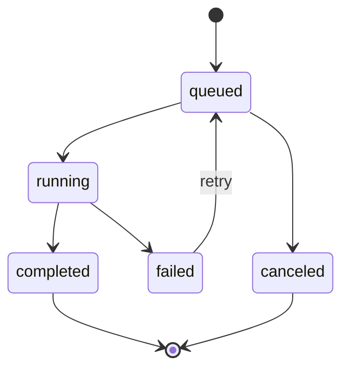
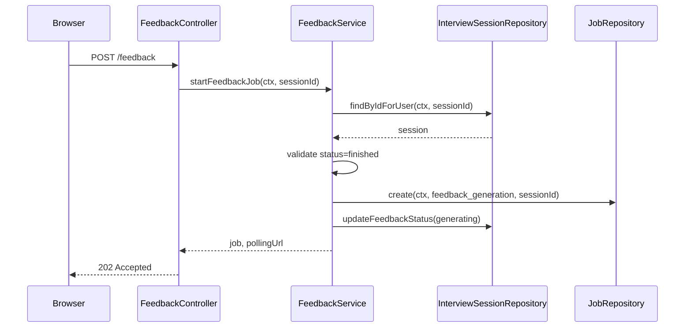
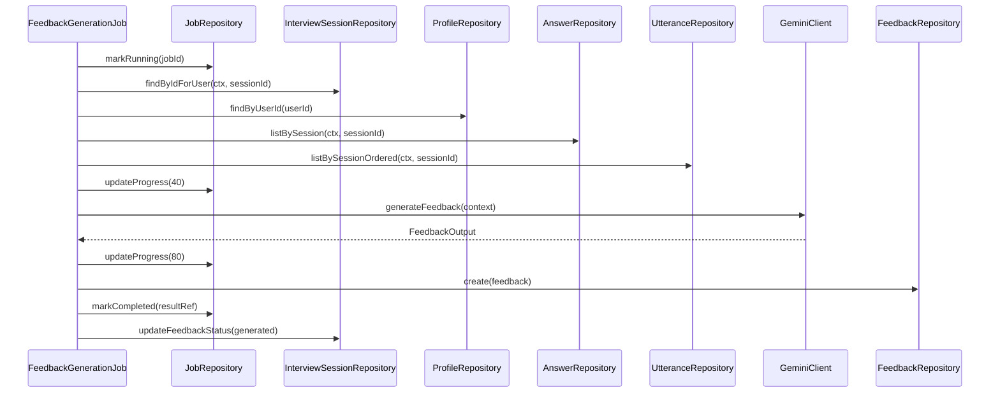

# AI面接練習支援システム フィードバックジョブ詳細設計書

## 1. 目的

本書は、面接終了後のフィードバック生成をジョブ型APIとして実装するための詳細設計を定義する。

対象は、ジョブ作成、ジョブ実行、Gemini連携、Firestore更新、進捗管理、失敗時復旧、再実行、将来のCloud Tasks移行である。

## 2. 基本方針

| 項目 | 方針 |
|---|---|
| 対象処理 | フィードバック生成 |
| API | `POST /interview-sessions/{sessionId}/feedback` |
| 状態取得 | `GET /jobs/{jobId}` |
| 結果取得 | `GET /interview-sessions/{sessionId}/feedback` |
| ジョブ保存 | Firestore `jobs` |
| 結果保存 | Firestore `feedbacks` |
| LLM | Gemini API |
| 出力形式 | Structured Outputs |
| MVP実行方式 | Backend API内ジョブ実行 |
| 将来候補 | Cloud Tasks + Cloud Run |

## 3. ジョブ状態

| 状態 | 内容 |
|---|---|
| `queued` | ジョブ作成済み、未実行 |
| `running` | 実行中 |
| `completed` | 正常完了 |
| `failed` | 失敗 |
| `canceled` | キャンセル済み |

状態遷移:



## 4. API仕様

### 4.1 ジョブ開始

```http
POST /api/v1/interview-sessions/{sessionId}/feedback
```

#### 実行条件

| 条件 | 内容 |
|---|---|
| 認証済み | Cookieセッションが有効 |
| 所有者一致 | `interviewSessions.userId == ctx.userId` |
| 面接終了済み | `interviewSessions.status == finished` |
| 音声保存 | 不要。会話テキストのみ利用 |

#### Response

```json
{
  "job": {
    "id": "job_001",
    "type": "feedback_generation",
    "status": "queued",
    "sessionId": "ses_001",
    "progress": 0,
    "createdAt": "2026-07-10T12:25:10+09:00",
    "updatedAt": "2026-07-10T12:25:10+09:00"
  },
  "pollingUrl": "/api/v1/jobs/job_001"
}
```

### 4.2 ジョブ状態取得

```http
GET /api/v1/jobs/{jobId}
```

#### Response

```json
{
  "job": {
    "id": "job_001",
    "type": "feedback_generation",
    "status": "running",
    "sessionId": "ses_001",
    "progress": 60,
    "resultRef": null,
    "error": null,
    "createdAt": "2026-07-10T12:25:10+09:00",
    "updatedAt": "2026-07-10T12:25:35+09:00"
  }
}
```

### 4.3 結果取得

```http
GET /api/v1/interview-sessions/{sessionId}/feedback
```

`jobs.status == completed` 後に結果取得する。

## 5. Firestore Document

### 5.1 jobs

```ts
type JobDoc = {
  id: string;
  type: "feedback_generation";
  status: "queued" | "running" | "completed" | "failed" | "canceled";
  sessionId: string;
  userId: string;
  progress: number;
  resultRef?: {
    type: "feedback";
    feedbackId: string;
    sessionId: string;
  } | null;
  error?: {
    code: string;
    message: string;
    retryable: boolean;
  } | null;
  createdAt: Timestamp;
  updatedAt: Timestamp;
  startedAt?: Timestamp;
  completedAt?: Timestamp;
};
```

### 5.2 feedbacks

```ts
type FeedbackDoc = {
  id: string;
  sessionId: string;
  userId: string;
  status: "generated" | "displaying" | "saved";
  overallSummary: string;
  goodPoints: FeedbackGoodPoint[];
  abstractPoints: FeedbackAbstractPoint[];
  consistencyCandidates: FeedbackConsistencyCandidate[];
  deepDiveShortage: string[];
  improvedAnswerExample: string;
  nextPracticeThemes: string[];
  createdAt: Timestamp;
  updatedAt: Timestamp;
};
```

## 6. ジョブ開始シーケンス



## 7. ジョブ実行シーケンス



## 8. 進捗設計

MVPでは概算進捗とする。

| progress | 状態 | 内容 |
|---|---|---|
| 0 | `queued` | ジョブ作成 |
| 10 | `running` | 実行開始 |
| 30 | `running` | 入力データ取得完了 |
| 60 | `running` | Gemini呼び出し中 |
| 80 | `running` | Gemini出力取得完了 |
| 100 | `completed` | 保存完了 |

厳密な進捗ではなく、画面表示用の目安とする。

## 9. Gemini入力データ

| 入力 | 内容 |
|---|---|
| プロフィール | 学歴、職歴、希望職種、自己PR素材 |
| 面接条件 | 面接種別、職種、業界、テーマ、質問数 |
| 会話履歴 | AI質問、ユーザ回答、発話ID、順序 |
| 回答分析 | 抽象度、具体性、矛盾候補、深掘り不足 |

音声ファイルは渡さない。

## 10. Gemini出力

`FeedbackOutput` はGeminiプロンプト詳細設計書に従う。

必須項目:

| 項目 | 内容 |
|---|---|
| `overallSummary` | 総評 |
| `goodPoints` | 良かった点 |
| `abstractPoints` | 抽象的だった箇所 |
| `consistencyCandidates` | 矛盾候補 |
| `deepDiveShortage` | 深掘り不足 |
| `improvedAnswerExample` | 改善回答例 |
| `nextPracticeThemes` | 次回練習テーマ |

Schema不一致の場合は1回だけ再試行する。

## 11. 失敗時設計

| 失敗箇所 | 状態 | retryable | 復旧 |
|---|---|---|---|
| セッションなし | `failed` | false | ユーザにエラー表示 |
| セッション未終了 | APIで `409` | false | 面接終了後に再実行 |
| Gemini API一時失敗 | `failed` | true | 再生成 |
| Gemini Schema不一致 | `failed` | true | 再生成 |
| Firestore保存失敗 | `failed` | true | 再生成 |
| 入力データ不足 | `failed` | false | 面接履歴確認 |

失敗時の `jobs.error` 例:

```json
{
  "code": "GEMINI_SCHEMA_MISMATCH",
  "message": "Gemini output did not match FeedbackOutput schema.",
  "retryable": true
}
```

## 12. 再実行設計

### 12.1 MVP方針

MVPでは、失敗したジョブを再利用せず、新しいジョブを作成する。

理由:

| 理由 | 内容 |
|---|---|
| 実装が単純 | ジョブ履歴を残しやすい |
| 追跡しやすい | 失敗ジョブと再実行ジョブを分けられる |
| 競合を避けやすい | 同一ジョブの状態巻き戻しを避ける |

### 12.2 再生成条件

| 条件 | 再生成可否 |
|---|---|
| `feedbackStatus == generation_failed` | 可 |
| `feedbackStatus == not_generated` | 可 |
| `feedbackStatus == generated` | MVPでは不可 |
| `feedbackStatus == generating` | 不可 |

## 13. 多重実行防止

`POST /feedback` 呼び出し時に、同一セッションで未完了ジョブが存在しないか確認する。

| 既存状態 | 応答 |
|---|---|
| `queued` | 既存ジョブを返す |
| `running` | 既存ジョブを返す |
| `completed` | `409 INVALID_STATE` または既存フィードバック取得を促す |
| `failed` | 新規ジョブ作成可 |

## 14. Cloud Run上の注意点

Cloud Runはリクエスト終了後のバックグラウンド処理に注意が必要である。

MVPでは以下のどちらかを選ぶ。

| 方式 | 内容 | 採用判断 |
|---|---|---|
| API内で同期的にジョブ実行を開始 | `202` 返却前または返却直後に処理する | 簡単だが長時間処理に注意 |
| Cloud Tasksを利用 | ジョブ作成後、Cloud Tasksで実行APIを呼ぶ | 推奨候補 |

堅く作る場合はCloud Tasksを利用する。

## 15. Cloud Tasks移行案

### 15.1 追加API

```http
POST /api/v1/internal/jobs/{jobId}/run
```

このAPIはCloud Tasksからのみ呼び出す。

### 15.2 シーケンス

```text
1. POST /feedback
2. jobsにqueuedを作成
3. Cloud Tasksへ /internal/jobs/{jobId}/run を登録
4. 202 Acceptedを返す
5. Cloud Tasksが実行APIを呼ぶ
6. ジョブ実行
7. completedまたはfailedへ更新
```

### 15.3 認証

Cloud Tasksからの内部API呼び出しは、OIDCトークンまたは専用ヘッダで検証する。

## 16. ログ設計

| ログ項目 | 内容 |
|---|---|
| `jobId` | ジョブID |
| `sessionId` | 面接セッションID |
| `userId` | ユーザID |
| `status` | ジョブ状態 |
| `progress` | 進捗 |
| `durationMs` | 実行時間 |
| `errorCode` | エラーコード |
| `retryable` | 再実行可否 |

ログに出さない:

| 項目 | 理由 |
|---|---|
| Geminiへの全文プロンプト | 個人情報を含む |
| APIキー | 機密情報 |
| Cookie | セキュリティリスク |

## 17. テスト観点

| 対象 | テスト |
|---|---|
| ジョブ作成 | finished状態で作成できる |
| ジョブ作成 | 未終了状態では409 |
| 多重実行 | queued/runningがある場合は既存ジョブを返す |
| ジョブ実行 | Gemini成功時にfeedbacks作成 |
| ジョブ実行 | Gemini失敗時にfailed |
| ジョブ実行 | Schema不一致時に1回再試行 |
| 再生成 | failed後に新規ジョブ作成 |
| 認可 | 他ユーザのジョブは取得できない |

## 18. 実装順序

1. `JobRepository.create` を実装
2. `FeedbackService.startFeedbackJob` を実装
3. `GET /jobs/{jobId}` を実装
4. `FeedbackGenerationJob` を実装
5. Gemini `generateFeedback` を接続
6. `FeedbackRepository.create` を実装
7. 完了・失敗時のトランザクション更新を実装
8. 多重実行防止を実装
9. 再生成処理を実装
10. Cloud Tasks移行用の内部APIを検討
