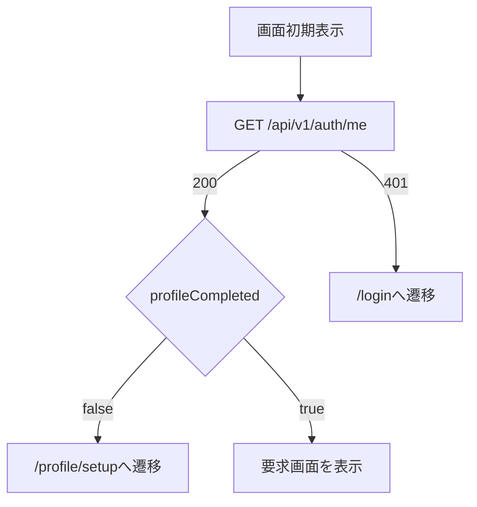
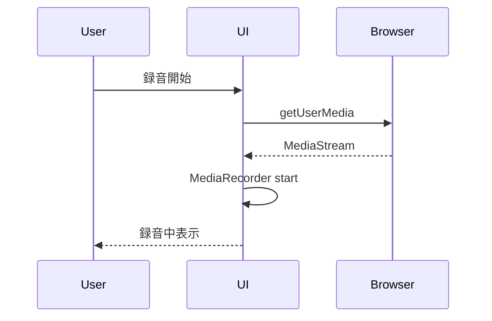
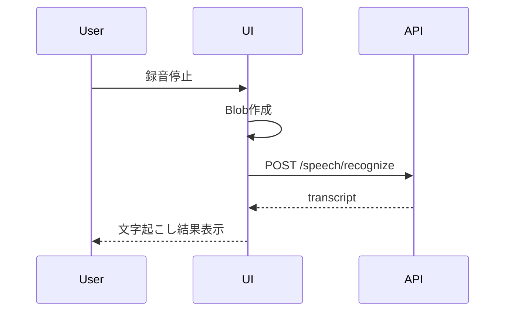

# AI面接練習支援システム フロントエンド状態管理・画面制御詳細設計書

## 1. 目的

本書は、AI面接練習支援システムのフロントエンドにおける状態管理、画面制御、API呼び出し、エラー復旧、UIコンポーネント制御の詳細設計を定義する。

対象は、ログイン後の画面遷移、プロフィール登録、面接条件設定、面接実施中の音声入力・音声認識・VOICEVOX再生・LLM分析、フィードバック表示、設定画面、共通UIである。

## 2. 基本方針

| 項目 | 方針 |
|---|---|
| 実装言語 | TypeScript |
| 画面構成 | SPAを想定 |
| API呼び出し | Backend APIのみ |
| 認証 | Cookieセッションを利用 |
| Google API直接呼び出し | しない |
| Gemini直接呼び出し | しない |
| VOICEVOX直接呼び出し | しない |
| 音声保存 | ブラウザ、サーバとも永続保存しない |
| 状態制御 | サーバ状態と画面内一時状態を分離する |

## 3. 状態管理の分類

| 分類 | 内容 | 保存場所 |
|---|---|---|
| 認証状態 | ログイン済み、未ログイン、プロフィール登録状態 | サーバ取得 + 画面メモリ |
| サーバ状態 | プロフィール、設定、面接セッション、質問、回答、フィードバック | Backend API |
| 画面内一時状態 | 入力中フォーム、録音中、認識中、再生中、ドロワー開閉 | フロントエンドメモリ |
| 一時音声データ | 録音直後のBlob、再生用Object URL | フロントエンドメモリ |
| モック専用状態 | モック確認用の画面切替、状態切替 | モックのみ |

実画面では、状態遷移の正はサーバ状態とAPIレスポンスを優先する。画面内一時状態は、表示制御と操作抑止のために利用する。

## 4. 画面ルーティング

| パス | 画面 | 認証 |
|---|---|---|
| `/login` | SCR-001 ログイン画面 | 未ログイン時 |
| `/profile/setup` | SCR-002 初期プロフィール登録画面 | 必須 |
| `/home` | SCR-003 ホーム画面 | 必須 |
| `/interviews/new` | SCR-004 面接条件設定画面 | 必須 |
| `/interviews/{sessionId}` | SCR-005 面接実施画面 | 必須 |
| `/interviews/{sessionId}/finish` | SCR-006 面接終了確認画面 | 必須 |
| `/interviews/{sessionId}/feedback` | SCR-007 フィードバック画面 | 必須 |
| `/history` | SCR-008 履歴一覧画面 | 必須 |
| `/history/{sessionId}` | SCR-009 履歴詳細画面 | 必須 |
| `/settings/profile` | SCR-010 プロフィール設定画面 | 必須 |
| `/settings/voice` | SCR-011 音声・面接官設定画面 | 必須 |

## 5. 認証ガード

### 5.1 初期表示時



### 5.2 ログイン画面

| 操作 | 実画面の処理 |
|---|---|
| Googleでログイン | `GET /api/v1/auth/google/start` へ遷移 |
| OAuth成功 | Backend APIがCookieセッションを発行 |
| OAuth失敗 | ログイン画面に戻し、再ログインを表示 |

モックの「Googleでログイン」ボタンによる直接画面遷移は、モック確認用の簡略動作である。実画面ではOAuth認証を必ず通過する。

## 6. 共通レイアウト

| 要素 | 内容 |
|---|---|
| ヘッダー | サービス名、ハンバーガーメニュー、ユーザ操作 |
| ハンバーガーメニュー | ホーム、面接開始、履歴、プロフィール設定、音声設定、ログアウト |
| メイン領域 | 各画面コンテンツ |
| ステータス表示 | 処理中、保存状態、エラー状態 |
| エラー表示 | 復旧可能な操作を一緒に表示 |

ハンバーガーメニューは、モバイル・デスクトップとも利用可能なドロワー形式とする。ドロワーは背景クリック、Escキー、メニュー選択で閉じる。

## 7. 面接実施画面の状態モデル

面接実施画面では、以下の状態を分離して持つ。

```ts
type InterviewPageState = {
  sessionStatus: SessionStatus;
  speechInputStatus: SpeechInputStatus;
  aiResponseStatus: AiResponseStatus;
  feedbackStatus: FeedbackStatus;
  recording: RecordingState;
  currentQuestion: QuestionView | null;
  answerDraft: string;
  transcriptConfidence: number | null;
  error: UiError | null;
};
```

### 7.1 sessionStatus

| 状態 | 表示・制御 |
|---|---|
| `question_generating` | 質問生成中。録音不可 |
| `question_presented` | 質問表示。音声再生または回答待機へ進む |
| `waiting_answer` | 録音開始、テキスト入力、終了が可能 |
| `recording` | 録音停止、キャンセルが可能 |
| `speech_recognizing` | 録音操作、回答送信を無効化 |
| `answer_confirming` | 文字起こし編集、回答送信、再録音が可能 |
| `answer_analyzing` | 回答分析中。操作を無効化 |
| `next_question_generating` | 次質問生成中。操作を無効化 |
| `finish_confirming` | 終了確認画面へ遷移 |
| `finished` | フィードバック生成へ進む |

### 7.2 speechInputStatus

| 状態 | 表示・制御 |
|---|---|
| `idle` | 録音開始可能 |
| `permission_checking` | マイク権限確認中 |
| `recording` | 録音中表示 |
| `recognizing` | 音声認識中表示 |
| `recognized` | 文字起こし結果を表示 |
| `recognition_failed` | 再録音、テキスト入力を表示 |
| `text_input` | 手入力欄を表示 |
| `ready_to_submit` | 回答送信可能 |

### 7.3 aiResponseStatus

| 状態 | 表示・制御 |
|---|---|
| `idle` | AI応答なし |
| `question_generating` | 質問生成中 |
| `voice_generating` | VOICEVOX音声生成中 |
| `voice_ready` | 再生可能 |
| `voice_playing` | 再生中 |
| `text_only` | 音声なしで質問文のみ表示 |
| `failed` | 再試行またはテキスト継続を表示 |

## 8. 面接実施画面の操作制御

| 操作 | 有効条件 | 処理 |
|---|---|---|
| 質問を再生 | `voice_ready` | 音声を再生 |
| 録音開始 | `waiting_answer` | マイク権限確認後に録音開始 |
| 録音停止 | `recording` | 録音停止後、音声認識APIを呼ぶ |
| 再録音 | `recognized` または `recognition_failed` | 回答下書きと一時音声を破棄 |
| テキスト入力に切替 | `waiting_answer` または `recognition_failed` | 手入力モードにする |
| 回答送信 | `ready_to_submit` | 回答保存・LLM分析APIを呼ぶ |
| 面接終了 | `waiting_answer` または `answer_confirming` | 終了確認へ進む |

二重送信を防ぐため、API呼び出し中のボタンは無効化する。

## 9. 録音制御

### 9.1 録音開始



### 9.2 録音停止



録音Blobは認識API送信後に破棄する。再録音時も既存BlobとObject URLを破棄する。

## 10. 音声認識結果の編集

| 項目 | 方針 |
|---|---|
| 編集可否 | 編集可能 |
| 保存対象 | 編集後テキスト |
| 認識結果原文 | MVPでは保存しない |
| confidence | 音声認識結果の参考値として回答データに保存可能 |

ユーザが編集した場合、回答送信時の `inputType` は `speech_corrected` として扱う。

## 11. VOICEVOX再生制御

| 状態 | 制御 |
|---|---|
| 音声生成中 | 再生ボタン無効 |
| 音声生成成功 | 再生ボタン有効 |
| 再生中 | 再生ボタンを停止または無効表示 |
| 音声生成失敗 | 質問文を表示し、音声なしで継続 |

VOICEVOX失敗は面接停止理由にしない。

### 11.1 質問の自動読み上げ

- 初回質問を画面へ表示した直後に、VOICEVOX音声を自動再生する。
- 回答送信後に次の質問を表示した直後も、自動再生する。
- ブラウザの自動再生制限へ対応するため、面接開始または回答送信のユーザー操作中に無音Audio要素を再生し、質問音声の再生許可を準備する。
- 質問取得後は、準備済みの同じAudio要素へ音声URLを設定して再生する。
- 自動再生に失敗しても面接処理を中断しない。画面へ案内を表示し、面接官欄の手動再生ボタンから再試行できるようにする。
- 最後の回答送信後は次の質問がないため、自動再生用Audioを準備しない。
- 手動再生ボタンのアクセシブルネームは「質問をもう一度読み上げる」とする。

### 11.2 音声回答ボタンの配置

- 「音声で回答」または「録音を停止」ボタンは、「回答を入力」見出しの横に配置する。
- 狭い画面では見出し直下へ折り返し、回答テキスト欄より前に表示する。
- 回答方法を先に選択してから入力欄へ視線が移る順序を維持する。

## 12. フィードバック画面制御

| 状態 | 表示・制御 |
|---|---|
| `not_started` | 生成開始可能 |
| `queued` | 受付済み表示 |
| `running` | 生成中表示 |
| `succeeded` | フィードバック表示 |
| `failed` | 再試行、ホームへ戻るを表示 |

フィードバック生成はジョブ型APIであるため、画面は `GET /api/v1/interview-sessions/{sessionId}/feedback` をポーリングして結果を取得する。

MVPのポーリング間隔は3秒とする。画面離脱後もジョブは継続する。

## 13. 設定画面の数値コントロール

対象:

| 項目 | 範囲 | 刻み |
|---|---|---|
| 話速 | 0.5 - 2.0 | 0.1 |
| 音量 | 0.5 - 2.0 | 0.1 |

操作:

| 操作 | 内容 |
|---|---|
| スライダー | ドラッグで変更 |
| `-` ボタン | 0.1下げる |
| `+` ボタン | 0.1上げる |
| 長押し | 押下中は0.1刻みで連続変更 |
| キーボード | 左右キーまたは上下キーで変更 |

値は小数誤差を避けるため、内部では10倍した整数として扱ってもよい。

## 14. モック専用UIと実画面UIの区別

| UI | 扱い |
|---|---|
| 画面一覧メニュー | モックでは全画面確認用。実画面では通常ナビゲーションに置き換える |
| 状態切替ボタン | モック専用。実画面では表示しない |
| `Visual Mock` 表示 | モック専用。実画面では表示しない |
| `MVP画面モック` 表示 | モック専用。実画面では表示しない |
| エラー復旧パターン画面への直接遷移 | モック確認用。実画面では発生したエラーに応じて表示する |

実画面では、状態はユーザ操作とAPIレスポンスにより遷移する。

## 15. API呼び出し一覧

| 画面 | API |
|---|---|
| ログイン | `GET /auth/me`, `GET /auth/google/start` |
| 初期プロフィール | `GET /profile`, `PUT /profile` |
| ホーム | `GET /auth/me`, `GET /interview-sessions` |
| 面接条件設定 | `GET /profile`, `POST /interview-sessions` |
| 面接実施 | `GET /interview-sessions/{id}`, `POST /initial-question`, `POST /speech/recognize`, `POST /voice/synthesize`, `POST /answers`, `POST /next-question`, `POST /finish` |
| フィードバック | `POST /feedback`, `GET /feedback` |
| 履歴 | `GET /interview-sessions`, `GET /interview-sessions/{id}` |
| 設定 | `GET /settings`, `PUT /settings`, `GET /profile`, `PUT /profile` |

## 16. エラー復旧

| エラー | 画面表示 | 復旧 |
|---|---|---|
| 401 | ログイン期限切れ | ログイン画面へ |
| 403 | 操作権限なし | ホームへ戻る |
| 404 | データなし | 履歴またはホームへ戻る |
| 409 | 状態不正 | 最新セッションを再取得 |
| 音声認識失敗 | 再録音またはテキスト入力 | 面接継続 |
| VOICEVOX失敗 | 質問文のみ表示 | 音声なしで継続 |
| LLM失敗 | 再試行または中断 | 状況に応じる |
| 通信失敗 | 再試行表示 | 同一操作を再実行 |

## 17. アクセシビリティ

| 項目 | 方針 |
|---|---|
| キーボード操作 | 主要操作はキーボードで実行可能にする |
| フォーカス管理 | ドロワー、モーダル、エラー表示で適切に移動する |
| 色依存 | 色だけで状態を伝えずテキストも併記する |
| 録音状態 | 録音中、認識中を明確な文言で表示する |
| 音声再生 | 音声が出ない場合も質問文で内容を確認可能にする |

## 18. テスト観点

| 対象 | テスト |
|---|---|
| AuthGuard | 未ログイン時にログインへ遷移 |
| AuthGuard | プロフィール未登録時に初期登録へ遷移 |
| 面接実施 | 録音開始から認識完了までの状態遷移 |
| 面接実施 | 認識失敗時に復旧操作を表示 |
| 面接実施 | 回答分析中に二重送信できない |
| 面接実施 | VOICEVOX失敗時にテキスト継続できる |
| フィードバック | ジョブ中に生成中表示 |
| フィードバック | 生成成功時に結果表示 |
| 設定 | 話速・音量が0.1刻みで変更できる |
| 共通UI | ハンバーガーメニューが開閉できる |

## 19. 実装順序

1. 画面ルーティングを実装
2. AuthGuardと `GET /auth/me` 連携を実装
3. 共通レイアウトとハンバーガーメニューを実装
4. プロフィール、面接条件フォームを実装
5. 面接実施画面の状態モデルを実装
6. 録音制御を実装
7. 音声認識API連携を実装
8. VOICEVOX再生制御を実装
9. 回答送信、次質問生成を接続
10. フィードバックジョブのポーリングを実装
11. 設定画面の数値コントロールを実装
12. エラー復旧表示を実装
13. 画面テストを追加
