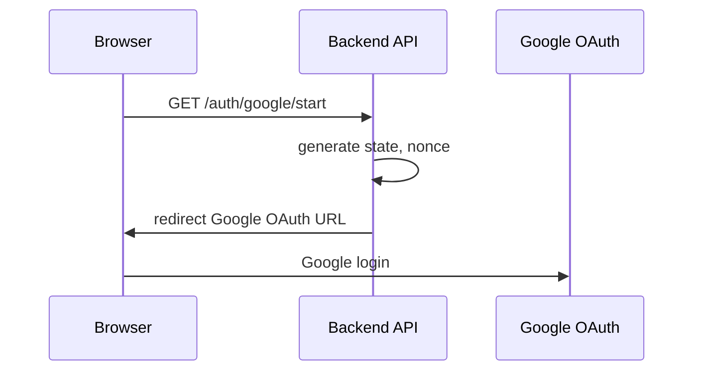
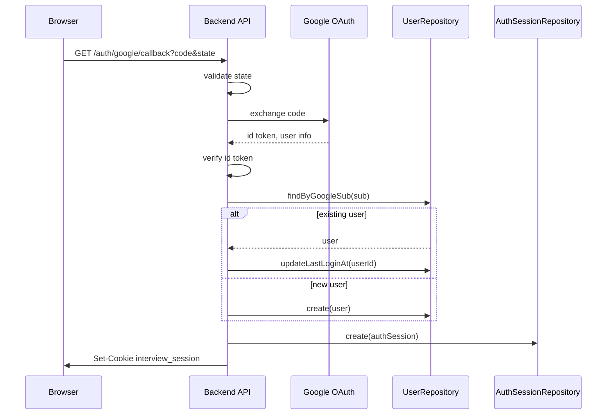
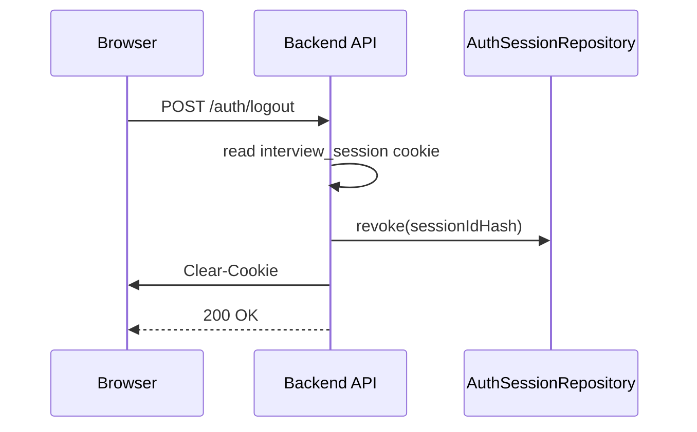

# AI面接練習支援システム 認証・セッション詳細設計書

## 1. 目的

本書は、Google OAuth と Cookieセッションを用いた認証・セッション管理の詳細設計を定義する。

対象は、ログイン、OAuthコールバック、Cookie発行、セッション検証、CSRF対策、ログアウト、期限切れ処理である。

## 2. 基本方針

| 項目 | 方針 |
|---|---|
| 認証方式 | Google OAuth |
| API認証 | Cookieセッション |
| Cookie名 | `interview_session` |
| セッション保存先 | Firestore `authSessions` |
| Cookie属性 | `HttpOnly`, `Secure`, `SameSite=Lax` |
| セッションID保存 | 平文保存しない。ハッシュ化して保存する |
| CSRF対策 | 状態変更APIでCSRFトークンまたはOriginチェックを行う |
| Bearer Token | ブラウザからの業務APIでは使用しない |

## 3. 認証フロー

### 3.1 ログイン開始

対象API:

```http
GET /api/v1/auth/google/start
```



処理:

| 順序 | 内容 |
|---|---|
| 1 | `state` を生成 |
| 2 | `nonce` を生成 |
| 3 | OAuth認可URLを生成 |
| 4 | Googleログイン画面へリダイレクト |

`state` はCSRF対策として利用する。MVPでは短時間有効な一時Cookieまたは一時セッションとして保持する。

### 3.2 OAuthコールバック

対象API:

```http
GET /api/v1/auth/google/callback
```



処理:

| 順序 | 内容 |
|---|---|
| 1 | `state` を検証 |
| 2 | `code` をGoogle OAuthへ送信し、トークンを取得 |
| 3 | ID Tokenを検証 |
| 4 | `sub`, `email`, `name` を取得 |
| 5 | `googleSub` でユーザを検索 |
| 6 | 未登録なら `users` に作成 |
| 7 | `authSessions` にセッションを作成 |
| 8 | Cookieを発行 |
| 9 | ホーム画面へリダイレクト |

## 4. Cookie設計

### 4.1 セッションCookie

| 項目 | 値 |
|---|---|
| Cookie名 | `interview_session` |
| 値 | ランダムなセッションID |
| HttpOnly | true |
| Secure | true |
| SameSite | `Lax` |
| Path | `/` |
| Max-Age | セッション有効期間に合わせる |

Cookie値は十分なランダム性を持つ文字列にする。

### 4.2 Cookie発行例

```http
Set-Cookie: interview_session=<session-id>; HttpOnly; Secure; SameSite=Lax; Path=/; Max-Age=1209600
```

MVPでは有効期間を14日程度とする。

## 5. Firestore保存設計

Path:

```text
authSessions/{sessionDocId}
```

### 5.1 Document

```ts
type AuthSessionDoc = {
  id: string;
  sessionIdHash: string;
  userId: string;
  csrfTokenHash?: string;
  createdAt: Timestamp;
  expiresAt: Timestamp;
  revokedAt?: Timestamp;
  userAgentHash?: string;
};
```

### 5.2 保存ルール

| 項目 | ルール |
|---|---|
| `sessionIdHash` | Cookie値をハッシュ化して保存 |
| `csrfTokenHash` | CSRFトークンを使う場合のみ保存 |
| `expiresAt` | 有効期限 |
| `revokedAt` | ログアウト時に設定 |
| `userAgentHash` | 任意。セッション異常検知に利用可能 |

セッションIDの平文は保存しない。

## 6. セッション検証

### 6.1 Middleware

```ts
async function authMiddleware(request, reply): Promise<void>
```

処理:

| 順序 | 内容 |
|---|---|
| 1 | Cookieから `interview_session` を取得 |
| 2 | 未設定なら `401 UNAUTHORIZED` |
| 3 | セッションIDをハッシュ化 |
| 4 | `AuthSessionRepository.findValidByHash()` を呼ぶ |
| 5 | セッションがなければ `401 UNAUTHORIZED` |
| 6 | `request.ctx.userId` に設定 |
| 7 | 後続処理へ進む |

### 6.2 有効セッション条件

| 条件 | 内容 |
|---|---|
| `sessionIdHash` 一致 | Cookie値のハッシュと一致 |
| `expiresAt > now` | 期限内 |
| `revokedAt == null` | 失効していない |

## 7. CSRF対策

### 7.1 方針

MVPでは以下を併用する。

| 対策 | 内容 |
|---|---|
| `SameSite=Lax` | 通常のクロスサイトPOSTを抑制 |
| Originチェック | 状態変更APIで `Origin` を検証 |
| CSRFトークン | 必要に応じて追加 |

### 7.2 Originチェック対象

状態変更APIを対象にする。

| Method | 対象 |
|---|---|
| POST | 全業務API |
| PUT | 全業務API |
| DELETE | 全業務API |

許可Originは環境変数で管理する。

```text
APP_ALLOWED_ORIGINS=https://example.com,http://localhost:5173
```

### 7.3 CSRFトークン方式

必要になった場合は、ログイン後にCSRFトークンを発行する。

| 項目 | 内容 |
|---|---|
| 保存 | `authSessions.csrfTokenHash` |
| 送信 | `X-CSRF-Token` ヘッダ |
| 検証 | ハッシュ比較 |

## 8. ログアウト

対象API:

```http
POST /api/v1/auth/logout
```



処理:

| 順序 | 内容 |
|---|---|
| 1 | CookieからセッションIDを取得 |
| 2 | セッションIDをハッシュ化 |
| 3 | `revokedAt` を設定 |
| 4 | Cookieを削除 |
| 5 | `loggedOut: true` を返す |

Cookie削除例:

```http
Set-Cookie: interview_session=; HttpOnly; Secure; SameSite=Lax; Path=/; Max-Age=0
```

## 9. ユーザ作成・更新

### 9.1 新規ユーザ

Google OAuthで初回ログインした場合、`users/{userId}` を作成する。

```ts
type CreateUserInput = {
  googleSub: string;
  email: string;
  displayName: string;
};
```

初期値:

| フィールド | 値 |
|---|---|
| `profileCompleted` | false |
| `createdAt` | now |
| `updatedAt` | now |
| `lastLoginAt` | now |

### 9.2 既存ユーザ

既存ユーザの場合は `lastLoginAt` を更新する。`email` や `displayName` が変化している場合は更新してよい。

## 10. 認可

認証はログインユーザを特定する処理であり、認可は対象データがログインユーザのものか確認する処理である。

RepositoryまたはServiceで、すべてのユーザ所有データに `userId` チェックを行う。

| 対象 | 認可条件 |
|---|---|
| `profiles/{userId}` | pathのuserIdとctx.userIdが一致 |
| `settings/{userId}` | pathのuserIdとctx.userIdが一致 |
| `interviewSessions/{sessionId}` | document.userIdとctx.userIdが一致 |
| `jobs/{jobId}` | document.userIdとctx.userIdが一致 |
| `feedbacks/{feedbackId}` | document.userIdとctx.userIdが一致 |

一致しない場合は `403 FORBIDDEN` を返す。

## 11. 期限切れセッション処理

### 11.1 方針

期限切れセッションは無効扱いとする。物理削除は定期処理で行う。

### 11.2 定期削除

MVPでは手動または管理スクリプトでよい。将来はCloud Scheduler + Cloud Run Jobsで実行する。

```text
Cloud Scheduler
  -> Cloud Run Job
    -> AuthSessionRepository.deleteExpired(now)
```

## 12. エラー設計

| 状況 | HTTP | code |
|---|---|---|
| Cookieなし | 401 | `UNAUTHORIZED` |
| セッションなし | 401 | `UNAUTHORIZED` |
| 期限切れ | 401 | `UNAUTHORIZED` |
| 失効済み | 401 | `UNAUTHORIZED` |
| Origin不正 | 403 | `FORBIDDEN` |
| CSRFトークン不正 | 403 | `FORBIDDEN` |
| OAuth state不正 | 400 | `VALIDATION_ERROR` |
| OAuth連携失敗 | 502 | `EXTERNAL_SERVICE_ERROR` |

## 13. ログ設計

ログに出す:

| 項目 | 内容 |
|---|---|
| `requestId` | リクエストID |
| `userId` | 認証後のユーザID |
| `operation` | `auth.login`, `auth.callback`, `auth.logout` など |
| `result` | `success` / `failure` |
| `errorCode` | エラー時 |

ログに出さない:

| 項目 | 理由 |
|---|---|
| セッションID平文 | セッション乗っ取りリスク |
| CSRFトークン平文 | セキュリティリスク |
| OAuth code | 認証情報 |
| ID Token | 認証情報 |
| Client Secret | 機密情報 |

## 14. テスト観点

| 対象 | テスト |
|---|---|
| OAuth callback | 新規ユーザ作成 |
| OAuth callback | 既存ユーザログイン |
| OAuth callback | state不一致 |
| Session validation | 有効セッション |
| Session validation | Cookieなし |
| Session validation | 期限切れ |
| Session validation | revokedAtあり |
| Logout | セッション失効、Cookie削除 |
| Origin check | 許可Origin、未許可Origin |
| Authorization | 他ユーザデータアクセス拒否 |

## 15. 実装順序

1. `crypto.ts` にセッションID生成、ハッシュ関数を実装
2. `AuthSessionRepository` を実装
3. `GoogleOAuthClient` を実装
4. `AuthService.handleOAuthCallback` を実装
5. Cookie発行・削除処理を実装
6. `authMiddleware` を実装
7. `csrfMiddleware` またはOriginチェックを実装
8. `GET /auth/me` を実装
9. `POST /auth/logout` を実装
10. 認証・認可テストを追加
