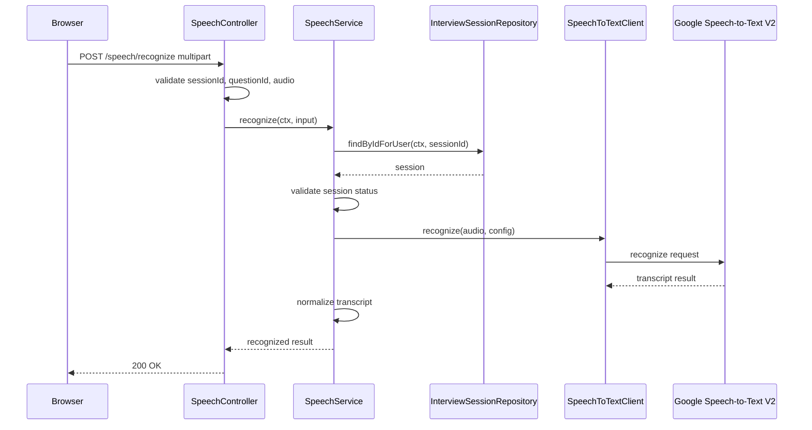

# AI面接練習支援システム 音声認識連携詳細設計書

## 1. 目的

本書は、ユーザ回答音声をテキスト化する音声認識連携の詳細設計を定義する。

対象は、ブラウザ録音、Backend APIへの音声送信、Google Cloud Speech-to-Text V2呼び出し、認識結果返却、音声非保存、失敗時復旧、ログ、テストである。

## 2. 基本方針

| 項目 | 方針 |
|---|---|
| 音声認識API | Google Cloud Speech-to-Text V2 |
| 音声認識モデル | Chirp 3 |
| 実行場所 | Cloud Run Backend API |
| ブラウザ直接呼び出し | しない |
| 音声保存 | 保存しない |
| 認識結果テキスト | 回答データとして保存する |
| MVP方式 | 録音完了後の同期認識 |
| ストリーミング | MVP対象外 |
| 失敗時 | 再録音またはテキスト入力で継続 |

## 3. 全体構成

```text
Browser
  -> Cloud Run Backend API
    -> Google Cloud Speech-to-Text V2
```

ブラウザは `POST /api/v1/speech/recognize` のみを呼び出す。Google Cloud APIの認証情報、プロジェクトID、Recognizer設定は画面へ露出しない。

## 4. 自アプリAPI

対象API:

```http
POST /api/v1/speech/recognize
Content-Type: multipart/form-data
```

### 4.1 Request

| フィールド | 型 | 必須 | 内容 |
|---|---|---|---|
| `sessionId` | string | yes | 面接セッションID |
| `questionId` | string | yes | 回答対象の質問ID |
| `audio` | file | yes | 録音音声ファイル |
| `languageCode` | string | no | 既定値は `ja-JP` |
| `audioFormat` | string | no | 例: `webm`, `wav` |

### 4.2 Response

```json
{
  "speechInputStatus": "recognized",
  "transcript": "私は前職で問い合わせ対応の集計を自動化しました。",
  "confidence": 0.91,
  "alternatives": [
    {
      "transcript": "私は前職で問い合わせ対応の集計を自動化しました。",
      "confidence": 0.91
    }
  ]
}
```

認識失敗時:

```json
{
  "speechInputStatus": "recognition_failed",
  "transcript": "",
  "confidence": null,
  "recoverable": true,
  "recoveryActions": ["retry_recording", "text_input"]
}
```

## 5. 処理シーケンス



## 6. 状態制御

| 条件 | 許可 |
|---|---|
| ログイン済み | 必須 |
| `session.userId == ctx.userId` | 必須 |
| 面接セッション状態が回答待機中または音声認識中 | 必須 |
| 質問IDが対象セッションに存在する | 必須 |
| 音声ファイルが上限以内 | 必須 |

不正な状態で呼び出された場合は `409 INVALID_STATE` を返す。

## 7. SpeechToTextClient設計

### 7.1 Interface

```ts
type SpeechRecognizeInput = {
  audioBuffer: Buffer;
  mimeType: string;
  languageCode: "ja-JP";
  model: "chirp_3";
};

type SpeechRecognizeResult = {
  transcript: string;
  confidence: number | null;
  alternatives: Array<{
    transcript: string;
    confidence: number | null;
  }>;
};

type SpeechToTextClient = {
  recognize(input: SpeechRecognizeInput): Promise<SpeechRecognizeResult>;
};
```

### 7.2 実装ルール

| 項目 | 内容 |
|---|---|
| timeout | 環境変数 `SPEECH_RECOGNITION_TIMEOUT_MS` を使用 |
| retry | MVPでは原則なし |
| language | `ja-JP` |
| model | `chirp_3` |
| result | 最有力候補を `transcript` とする |
| error | `ExternalServiceError` に変換 |

## 8. SpeechService設計

### 8.1 Interface

```ts
type SpeechServiceInput = {
  sessionId: string;
  questionId: string;
  audioBuffer: Buffer;
  mimeType: string;
  audioFormat?: string;
};

type SpeechServiceResult =
  | {
      speechInputStatus: "recognized";
      transcript: string;
      confidence: number | null;
      alternatives: Array<{
        transcript: string;
        confidence: number | null;
      }>;
    }
  | {
      speechInputStatus: "recognition_failed";
      transcript: "";
      confidence: null;
      recoverable: true;
      recoveryActions: Array<"retry_recording" | "text_input">;
    };
```

### 8.2 処理

| 順序 | 内容 |
|---|---|
| 1 | Cookieセッションからログインユーザを取得 |
| 2 | `sessionId`, `questionId`, `audio` を検証 |
| 3 | 面接セッションと質問の所有者を確認 |
| 4 | 面接セッション状態を検証 |
| 5 | 音声ファイルサイズ、MIME typeを検証 |
| 6 | Google Cloud Speech-to-Text V2を呼び出す |
| 7 | 認識結果を整形する |
| 8 | 認識結果を画面へ返す |

このAPIではDBへ回答を保存しない。回答保存とLLM分析は `POST /api/v1/interview-sessions/{sessionId}/answers` で行う。

## 9. 音声データの扱い

| 項目 | 方針 |
|---|---|
| ブラウザ録音データ | 認識APIへ送信する |
| Backend API内の音声バッファ | リクエスト処理中のみ保持 |
| Google Cloud Speech-to-Text送信 | 音声認識処理のため一時的に送信 |
| DB保存 | しない |
| Cloud Storage保存 | しない |
| ログ出力 | しない |

音声データは、認識処理の完了または失敗後に破棄する。

## 10. 入力制限

| 項目 | MVP値 |
|---|---|
| 最大録音時間 | 5分 |
| 最大ファイルサイズ | 25MB |
| 言語 | 日本語 |
| 推奨形式 | ブラウザ録音で扱いやすい形式 |
| 代替手段 | テキスト入力 |

ブラウザや端末により録音形式が異なるため、Backend APIではMIME typeを検証し、対応外形式の場合は `400 VALIDATION_ERROR` を返す。

## 11. 失敗時設計

| 失敗箇所 | 応答 | 復旧 |
|---|---|---|
| マイク権限なし | 画面側で検知 | 権限許可、テキスト入力 |
| 音声ファイルなし | `400 VALIDATION_ERROR` | 再録音 |
| ファイルサイズ超過 | `413 PAYLOAD_TOO_LARGE` | 短く再録音 |
| 対応外形式 | `400 VALIDATION_ERROR` | 再録音、テキスト入力 |
| Speech-to-Text失敗 | `recognition_failed` | 再録音、テキスト入力 |
| タイムアウト | `recognition_failed` | 再録音、テキスト入力 |
| セッション不正 | `403 FORBIDDEN` または `404 NOT_FOUND` | 画面遷移 |
| 状態不正 | `409 INVALID_STATE` | 最新状態を取得 |

音声認識失敗は面接停止理由にしない。ユーザがテキスト入力へ切り替えれば面接を継続できる。

## 12. 画面連携

| 画面状態 | API呼び出し |
|---|---|
| 録音中 | API呼び出しなし |
| 録音停止 | `POST /speech/recognize` |
| 音声認識中 | ボタンを無効化し、処理中表示 |
| 認識完了 | 文字起こし結果を回答欄に表示 |
| 認識失敗 | 再録音、テキスト入力を表示 |

ユーザは認識結果を確認し、必要に応じて編集してから回答送信する。

## 13. ログ設計

ログに出す:

| 項目 | 内容 |
|---|---|
| `requestId` | リクエストID |
| `userId` | ログインユーザID |
| `sessionId` | 面接セッションID |
| `questionId` | 質問ID |
| `audioSize` | 音声サイズ |
| `mimeType` | MIME type |
| `durationMs` | 処理時間 |
| `result` | `recognized` / `recognition_failed` |
| `errorCode` | エラー時 |

ログに出さない:

| 項目 | 理由 |
|---|---|
| 音声バイナリ | 音声非保存方針 |
| 認識結果全文 | 個人情報・回答内容を含む可能性 |
| Cookie | セキュリティ |
| Google Cloud認証情報 | 機密情報 |

## 14. セキュリティ

| 項目 | 方針 |
|---|---|
| API認証 | Cookieセッション必須 |
| Google Cloud認証 | Cloud Runサービスアカウント |
| ブラウザへの認証情報露出 | 禁止 |
| CORS | 自アプリのフロントエンドのみ許可 |
| 音声保存 | 禁止 |
| 権限 | Speech-to-Text利用に必要な最小権限 |

## 15. 環境変数

| 環境変数 | 内容 |
|---|---|
| `GCP_PROJECT_ID` | Google CloudプロジェクトID |
| `DEFAULT_SPEECH_RECOGNITION_MODEL` | 既定モデル。MVPでは `chirp_3` |
| `DEFAULT_SPEECH_LANGUAGE_CODE` | 既定言語。MVPでは `ja-JP` |
| `SPEECH_RECOGNITION_TIMEOUT_MS` | 音声認識タイムアウト |
| `SPEECH_MAX_AUDIO_BYTES` | 最大音声サイズ |

## 16. テスト観点

| 対象 | テスト |
|---|---|
| SpeechController | multipart request成功 |
| SpeechController | audio未指定 |
| SpeechController | ファイルサイズ超過 |
| SpeechService | セッション所有者チェック |
| SpeechService | 状態不正時に409 |
| SpeechService | 認識成功時にtranscript返却 |
| SpeechService | 認識失敗時に復旧候補返却 |
| SpeechToTextClient | Google API成功 |
| SpeechToTextClient | タイムアウト |
| SpeechToTextClient | 外部APIエラー |

## 17. 実装順序

1. 環境変数を追加
2. `SpeechToTextClient` を実装
3. `SpeechService.recognize` を実装
4. `SpeechController` を実装
5. multipart/form-dataの入力検証を実装
6. 音声サイズ・MIME type制限を実装
7. `recognition_failed` 復旧レスポンスを実装
8. 画面の録音停止後に `POST /speech/recognize` を接続
9. テストを追加

## 18. 将来拡張

| 項目 | 導入条件 |
|---|---|
| ストリーミング認識 | 複数人利用、長時間回答、待ち時間改善が必要になった場合 |
| ジョブ型音声認識 | 長い音声や混雑時に同期処理が不安定になった場合 |
| 多言語対応 | 英語面接などを扱う場合 |
| 話者分離 | 複数人面接を扱う場合 |
| 認識候補の比較UI | 誤認識修正をより丁寧に扱う場合 |
